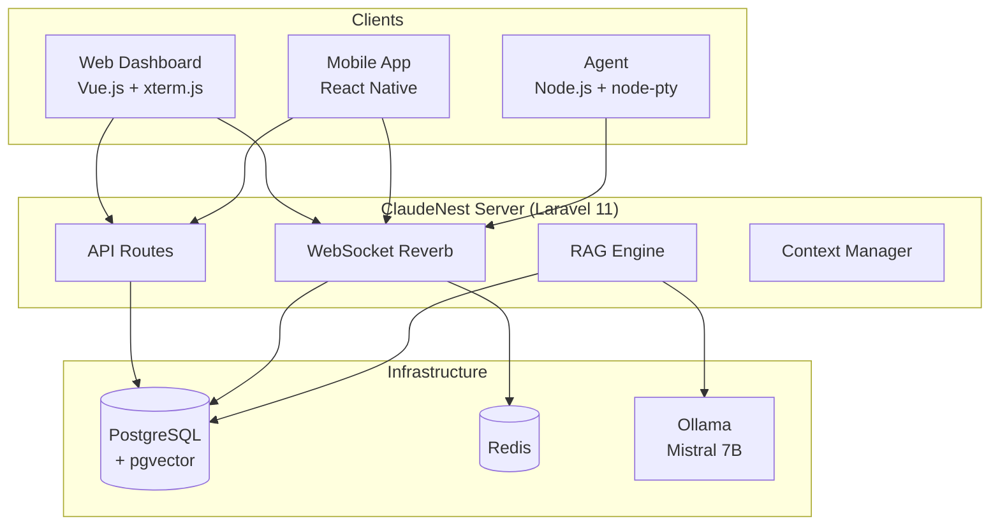
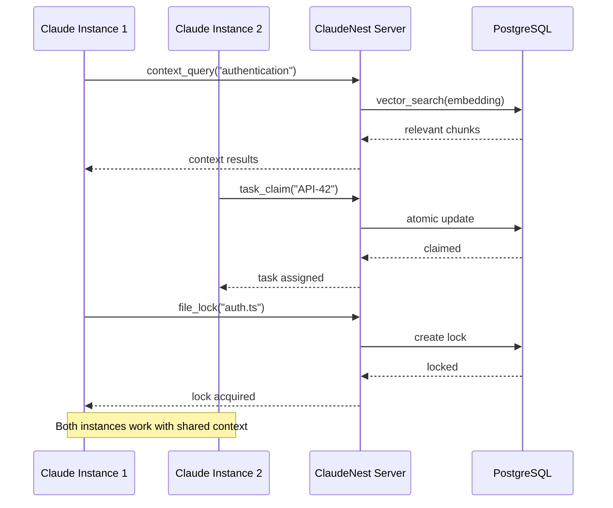
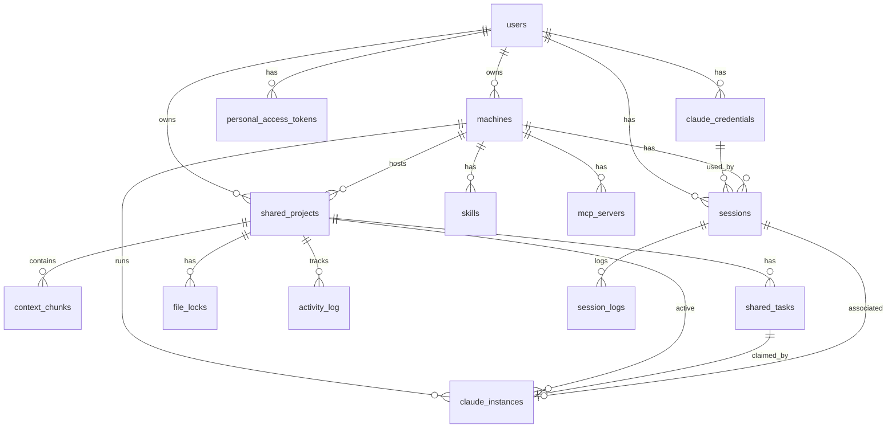

# ClaudeNest - AI Agent Documentation

> **FOR AI AGENTS/LLMs**: This document is the single source of truth for understanding and working with the ClaudeNest codebase.
> 
> **Version**: 1.1.0
> **Last Updated**: 2026-02-16

---

## Table of Contents

1. [Project Overview](#1-project-overview)
2. [Directory Structure](#2-directory-structure)
3. [Key Concepts](#3-key-concepts)
4. [Code Patterns](#4-code-patterns)
5. [Database Schema](#5-database-schema)
6. [API Endpoints](#6-api-endpoints)
7. [Environment Variables](#7-environment-variables)
8. [Common Tasks](#8-common-tasks)
9. [Testing](#9-testing)
10. [Deployment](#10-deployment)

---

## 1. Project Overview

### What is ClaudeNest

ClaudeNest is a **remote Claude Code orchestration platform** that enables:
- Remote control of Claude Code instances from anywhere
- Multi-agent coordination (run multiple Claude instances on the same project)
- Context RAG with pgvector for shared understanding
- Real-time WebSocket communication
- File locking for conflict prevention
- Task coordination with atomic claiming

### Architecture Overview



### Tech Stack Details

| Package | Technology | Purpose |
|---------|------------|---------|
| `@claude-remote/server` | Laravel 11, Vue.js 3, xterm.js | Backend API, WebSocket relay, Web dashboard |
| `@claude-remote/agent` | Node.js 20, TypeScript, node-pty | Local daemon, PTY management |
| `@claude-remote/mobile` | React Native 0.73, Zustand | iOS & Android apps |

### Key Features

- **Remote Access**: Control Claude Code from anywhere
- **Multi-Agent System**: Run multiple Claude instances on the same project
- **Context RAG**: pgvector-powered retrieval augmented generation
- **File Locking**: Prevent conflicts between agents
- **Task Coordination**: Atomic task claiming system
- **WebSocket Communication**: Real-time bidirectional communication
- **MCP Support**: Model Context Protocol integration
- **Mobile Apps**: Native iOS and Android applications
- **Credential Management**: Encrypted API key & OAuth token storage with AES-256-CBC
- **Dark/Light Theme**: System-aware theming with CSS variables
- **IDE-style Layout**: Collapsible sidebar, tab bar, status bar
- **Internationalization**: Full FR/EN support via vue-i18n

---

## 2. Directory Structure

```
claudenest/
├── 📁 packages/
│   │
│   ├── 📁 server/                          # @claude-remote/server (Laravel 11)
│   │   ├── 📁 app/
│   │   │   ├── 📁 Broadcasting/            # Broadcast channels
│   │   │   ├── 📁 Console/Commands/        # Artisan commands
│   │   │   ├── 📁 Events/                  # Laravel events
│   │   │   │   ├── FileLocked.php
│   │   │   │   ├── FileUnlocked.php
│   │   │   │   ├── ProjectBroadcast.php
│   │   │   │   ├── SessionCreated.php
│   │   │   │   ├── SessionInput.php
│   │   │   │   ├── SessionOutput.php
│   │   │   │   ├── SessionResize.php
│   │   │   │   ├── SessionTerminated.php
│   │   │   │   ├── TaskClaimed.php
│   │   │   │   ├── TaskCompleted.php
│   │   │   │   ├── TaskCreated.php
│   │   │   │   └── TaskReleased.php
│   │   │   ├── 📁 Http/
│   │   │   │   ├── 📁 Controllers/
│   │   │   │   │   ├── 📁 Api/             # API controllers
│   │   │   │   │   │   ├── AuthController.php
│   │   │   │   │   │   ├── CommandsController.php
│   │   │   │   │   │   ├── ContextController.php
│   │   │   │   │   │   ├── FileLockController.php
│   │   │   │   │   │   ├── MCPController.php
│   │   │   │   │   │   ├── MachineController.php
│   │   │   │   │   │   ├── ProjectController.php
│   │   │   │   │   │   ├── SessionController.php
│   │   │   │   │   │   ├── CredentialController.php
│   │   │   │   │   │   ├── SkillsController.php
│   │   │   │   │   │   └── TaskController.php
│   │   │   │   │   └── 📁 Web/             # Web controllers
│   │   │   │   ├── 📁 Middleware/
│   │   │   │   ├── 📁 Requests/            # Form requests
│   │   │   │   │   ├── StoreCredentialRequest.php
│   │   │   │   │   └── UpdateCredentialRequest.php
│   │   │   │   └── 📁 Resources/           # API resources
│   │   │   │       └── CredentialResource.php
│   │   │   ├── 📁 Models/                  # Eloquent models
│   │   │   │   ├── ActivityLog.php
│   │   │   │   ├── ClaudeCredential.php
│   │   │   │   ├── ClaudeInstance.php
│   │   │   │   ├── ContextChunk.php
│   │   │   │   ├── DiscoveredCommand.php
│   │   │   │   ├── FileLock.php
│   │   │   │   ├── MCPServer.php
│   │   │   │   ├── Machine.php
│   │   │   │   ├── PersonalAccessToken.php
│   │   │   │   ├── PushToken.php
│   │   │   │   ├── Session.php
│   │   │   │   ├── SessionLog.php
│   │   │   │   ├── SharedProject.php
│   │   │   │   ├── SharedTask.php
│   │   │   │   ├── Skill.php
│   │   │   │   └── User.php
│   │   │   ├── 📁 Policies/                # Authorization policies
│   │   │   ├── 📁 Providers/               # Service providers
│   │   │   └── 📁 Services/                # Business logic
│   │   │       ├── ContextRAGService.php
│   │   │       ├── CredentialService.php
│   │   │       ├── EmbeddingService.php
│   │   │       ├── MCPManagerService.php
│   │   │       ├── SkillDiscoveryService.php
│   │   │       └── SummarizationService.php
│   │   ├── 📁 bootstrap/
│   │   ├── 📁 config/
│   │   │   └── claudenest.php              # App config
│   │   ├── 📁 database/
│   │   │   ├── 📁 factories/
│   │   │   ├── 📁 migrations/
│   │   │   └── 📁 seeders/
│   │   ├── 📁 resources/
│   │   │   ├── 📁 js/                      # Vue.js SPA
│   │   │   │   ├── 📁 components/
│   │   │   │   │   ├── 📁 common/          # UI components
│   │   │   │   │   ├── 📁 docs/            # Documentation components
│   │   │   │   │   ├── 📁 layout/          # Layout components
│   │   │   │   │   ├── 📁 machines/        # Machine components
│   │   │   │   │   ├── 📁 mcp/             # MCP components
│   │   │   │   │   ├── 📁 multiagent/      # Multi-agent components
│   │   │   │   │   ├── 📁 projects/        # Project components
│   │   │   │   │   ├── 📁 sessions/        # Session components
│   │   │   │   │   ├── 📁 skills/          # Skills components
│   │   │   │   │   └── 📁 terminal/        # Terminal components
│   │   │   │   ├── 📁 composables/         # Vue composables
│   │   │   │   │   ├── useTabs.ts          # Multi-tab management
│   │   │   │   │   ├── useTheme.ts         # Dark/light mode
│   │   │   │   │   └── useToast.ts         # Toast notifications
│   │   │   │   ├── 📁 layouts/             # Page layouts
│   │   │   │   │   └── AppLayout.vue       # IDE-style layout
│   │   │   │   ├── 📁 locales/             # i18n translations
│   │   │   │   │   ├── en.json             # English
│   │   │   │   │   └── fr.json             # French
│   │   │   │   ├── 📁 pages/               # Page components
│   │   │   │   │   ├── 📁 credentials/     # Credential management
│   │   │   │   │   ├── Landing.vue         # Public landing page
│   │   │   │   │   ├── Pricing.vue         # Pricing page
│   │   │   │   │   └── Changelog.vue       # Changelog page
│   │   │   │   ├── 📁 services/            # API services
│   │   │   │   ├── 📁 stores/              # Pinia stores
│   │   │   │   │   └── credentials.ts      # Credentials store
│   │   │   │   ├── 📁 types/               # TypeScript types
│   │   │   │   └── 📁 utils/               # Utilities
│   │   │   └── 📁 views/                   # Blade templates
│   │   ├── 📁 routes/
│   │   │   ├── api.php                     # API routes
│   │   │   ├── channels.php                # Broadcast channels
│   │   │   └── web.php                     # Web routes
│   │   └── 📁 tests/
│   │
│   ├── 📁 agent/                           # @claude-remote/agent (Node.js)
│   │   ├── 📁 src/
│   │   │   ├── 📁 context/                 # Context sync client
│   │   │   │   ├── client.ts
│   │   │   │   └── index.ts
│   │   │   ├── 📁 discovery/               # Skills/MCP discovery
│   │   │   │   ├── index.ts
│   │   │   │   ├── mcp.ts
│   │   │   │   └── skills.ts
│   │   │   ├── 📁 handlers/                # Message handlers
│   │   │   │   ├── config-handler.ts
│   │   │   │   ├── context-handler.ts
│   │   │   │   ├── index.ts
│   │   │   │   └── session-handler.ts
│   │   │   ├── 📁 sessions/                # Session management
│   │   │   │   ├── claude-process.ts
│   │   │   │   ├── index.ts
│   │   │   │   └── manager.ts
│   │   │   ├── 📁 types/                   # TypeScript types
│   │   │   │   └── index.ts
│   │   │   ├── 📁 utils/                   # Utilities
│   │   │   │   ├── index.ts
│   │   │   │   └── logger.ts
│   │   │   ├── 📁 websocket/               # WebSocket client
│   │   │   │   ├── client.ts
│   │   │   │   └── index.ts
│   │   │   ├── agent.ts                    # Main agent class
│   │   │   └── index.ts                    # Entry point
│   │   └── package.json
│   │
│   └── 📁 mobile/                          # @claude-remote/mobile (React Native)
│       ├── 📁 src/
│       │   ├── 📁 components/
│       │   │   ├── 📁 common/
│       │   │   ├── 📁 machines/
│       │   │   ├── 📁 multiagent/
│       │   │   └── 📁 sessions/
│       │   ├── 📁 navigation/              # React Navigation
│       │   ├── 📁 screens/
│       │   │   ├── 📁 auth/
│       │   │   ├── 📁 config/
│       │   │   ├── 📁 machines/
│       │   │   ├── 📁 multiagent/
│       │   │   ├── 📁 sessions/
│       │   │   └── 📁 settings/
│       │   ├── 📁 services/                # API/WebSocket clients
│       │   ├── 📁 stores/                  # Zustand stores
│       │   ├── 📁 theme/                   # Theme configuration
│       │   ├── 📁 types/                   # TypeScript types
│       │   ├── 📁 utils/                   # Utilities
│       │   └── App.tsx
│       ├── android/
│       └── ios/
│
├── 📁 branding/                            # Brand assets
├── 📁 docs/                                # Documentation
├── 📁 scripts/                             # Setup scripts
└── package.json                            # Root package.json
```

---

## 3. Key Concepts

### 3.1 Multi-Agent System

ClaudeNest enables multiple Claude instances to work on the same project simultaneously through:

- **Shared Projects**: Central project context storage
- **Context Chunks**: RAG-powered context retrieval with pgvector
- **Task Coordination**: Atomic task claiming system
- **File Locking**: Prevent conflicts on the same files



### 3.2 Context RAG with pgvector

The RAG (Retrieval-Augmented Generation) system:

1. **Embedding**: `bge-small-en-v1.5` generates 384-dimensional vectors
2. **Storage**: Vectors stored in PostgreSQL with pgvector extension
3. **Search**: Cosine similarity search for relevant context
4. **Compilation**: Context assembled for each instance

```php
// Context search flow
$embedding = $embeddingService->generate($query);
$chunks = ContextChunk::findSimilar($projectId, $embedding, $limit);
```

### 3.3 WebSocket Communication

Real-time communication via Laravel Reverb:

| Direction | Event | Description |
|-----------|-------|-------------|
| Agent → Server | `session:output` | Terminal output |
| Agent → Server | `session:status` | Status updates |
| Server → Agent | `session:input` | User input |
| Server → Agent | `session:resize` | PTY resize |
| Both | `task:claim`, `task:complete` | Task coordination |

### 3.4 MCP (Model Context Protocol)

MCP servers provide tools to Claude Code:

- **Discovery**: Agent discovers MCP servers on the local machine
- **Registration**: Servers registered with the backend
- **Execution**: Tools executed via agent
- **Status**: Real-time status updates

### 3.5 File Locking

Prevents conflicts when multiple agents work on the same project:

```php
// Lock a file
FileLock::create([
    'project_id' => $projectId,
    'path' => 'src/auth.ts',
    'locked_by' => $instanceId,
    'expires_at' => now()->addMinutes(30),
]);

// Check before editing
if (FileLock::isLocked($projectId, 'src/auth.ts')) {
    // Wait or choose different file
}
```

### 3.6 Task Coordination

Atomic task claiming system:

```php
// Claim a task (atomic operation)
$task = SharedTask::claim($taskId, $instanceId);

// Release when done
$task->release();

// Complete with summary
$task->complete($summary, $filesModified);
```

### 3.7 Credential Management

Encrypted storage for Claude API keys and OAuth tokens:

- **Encryption**: AES-256-CBC via Laravel's `Crypt::encryptString()`
- **Auth Types**: `api_key` (direct API key) and `oauth` (OAuth token + refresh)
- **Token Status**: `active`, `expired`, `revoked`
- **Default Credential**: One credential per user can be marked as default
- **Session Binding**: Sessions can optionally use a specific credential

```php
// Create encrypted credential
$credential = ClaudeCredential::create([
    'user_id' => $user->id,
    'name' => 'my-api-key',
    'auth_type' => 'api_key',
    'api_key' => Crypt::encryptString($rawKey),
    'is_default' => true,
]);

// Decrypt for use
$rawKey = Crypt::decryptString($credential->api_key);
```

### 3.8 Internationalization (i18n)

Full FR/EN support via `vue-i18n`:

- **Locale Files**: `resources/js/locales/{en,fr}.json`
- **Usage in templates**: `{{ $t('sessions.create.title') }}`
- **Usage in scripts**: `const { t } = useI18n(); t('key')`
- **Parameterized**: `$t('key', { param: value })`

### 3.9 Theme System

Dark/light mode with system-aware detection:

- **Composable**: `useTheme()` → `theme`, `resolvedTheme`, `isDark`, `toggleTheme`
- **CSS Variables**: Defined in `resources/css/themes.css`
- **Persistence**: `localStorage` key `claudenest-theme`
- **Modes**: `dark` (default), `light`, `system`

---

## 4. Code Patterns

### 4.1 Backend (Laravel)

#### Controller Patterns

```php
<?php
// Standard API controller structure
namespace App\Http\Controllers\Api;

use App\Http\Controllers\Controller;
use App\Http\Resources\MachineResource;
use Illuminate\Http\JsonResponse;
use Illuminate\Http\Request;

class MachineController extends Controller
{
    /**
     * List resources with pagination.
     */
    public function index(Request $request): JsonResponse
    {
        $perPage = $request->input('per_page', 15);
        
        $machines = $request->user()
            ->machines()
            ->paginate($perPage);

        return response()->json([
            'success' => true,
            'data' => MachineResource::collection($machines),
            'meta' => [
                'timestamp' => now()->toIso8601String(),
                'request_id' => $request->header('X-Request-ID', uniqid()),
                'pagination' => [
                    'current_page' => $machines->currentPage(),
                    'last_page' => $machines->lastPage(),
                    'per_page' => $machines->perPage(),
                    'total' => $machines->total(),
                ],
            ],
        ]);
    }

    /**
     * Helper: Standard error response.
     */
    private function errorResponse(string $code, string $message, int $status): JsonResponse
    {
        return response()->json([
            'success' => false,
            'error' => [
                'code' => $code,
                'message' => $message,
            ],
            'meta' => [
                'timestamp' => now()->toIso8601String(),
                'request_id' => request()->header('X-Request-ID', uniqid()),
            ],
        ], $status);
    }
}
```

#### API Resource Patterns

```php
<?php
// API Resource for consistent response formatting
namespace App\Http\Resources;

use Illuminate\Http\Resources\Json\JsonResource;

class MachineResource extends JsonResource
{
    public function toArray($request): array
    {
        return [
            'id' => $this->id,
            'name' => $this->name,
            'display_name' => $this->display_name,
            'platform' => $this->platform,
            'status' => $this->status,
            'is_online' => $this->is_online,
            'capabilities' => $this->capabilities,
            'active_sessions_count' => $this->active_sessions_count,
            'last_seen_at' => $this->last_seen_at?->toIso8601String(),
            'created_at' => $this->created_at->toIso8601String(),
            'last_seen_human' => $this->last_seen_at?->diffForHumans(),
        ];
    }
}
```

#### Service Patterns

```php
<?php
// Service class for business logic
namespace App\Services;

use App\Models\ContextChunk;
use App\Models\SharedProject;

class ContextRAGService
{
    private EmbeddingService $embeddingService;
    private SummarizationService $summarizationService;

    public function __construct(
        EmbeddingService $embeddingService,
        SummarizationService $summarizationService
    ) {
        $this->embeddingService = $embeddingService;
        $this->summarizationService = $summarizationService;
    }

    /**
     * Add context chunk to project.
     */
    public function addContext(
        SharedProject $project,
        string $content,
        string $type,
        array $metadata = []
    ): ?ContextChunk {
        // Generate embedding
        $embedding = null;
        if ($this->embeddingService->isAvailable()) {
            $embedding = $this->embeddingService->generate($content);
        }

        $chunk = ContextChunk::create([
            'project_id' => $project->id,
            'content' => $content,
            'type' => $type,
            'instance_id' => $metadata['instance_id'] ?? null,
            'task_id' => $metadata['task_id'] ?? null,
            'files' => $metadata['files'] ?? [],
            'importance_score' => $metadata['importance_score'] ?? 0.5,
            'expires_at' => $metadata['expires_at'] ?? now()->addDays(30),
        ]);

        if ($embedding) {
            $chunk->setEmbedding($embedding);
        }

        return $chunk;
    }
}
```

#### Event Patterns

```php
<?php
// Broadcasting event for real-time updates
namespace App\Events;

use App\Models\Session;
use Illuminate\Broadcasting\Channel;
use Illuminate\Broadcasting\InteractsWithSockets;
use Illuminate\Broadcasting\PrivateChannel;
use Illuminate\Contracts\Broadcasting\ShouldBroadcast;
use Illuminate\Foundation\Events\Dispatchable;
use Illuminate\Queue\SerializesModels;

class SessionOutput implements ShouldBroadcast
{
    use Dispatchable, InteractsWithSockets, SerializesModels;

    public function __construct(
        public Session $session,
        public string $data,
        public ?string $chunkId = null
    ) {}

    public function broadcastOn(): array
    {
        return [
            new PrivateChannel('sessions.' . $this->session->id),
        ];
    }

    public function broadcastAs(): string
    {
        return 'session.output';
    }

    public function broadcastWith(): array
    {
        return [
            'session_id' => $this->session->id,
            'data' => $this->data,
            'chunk_id' => $this->chunkId,
            'timestamp' => now()->toIso8601String(),
        ];
    }
}
```

#### Model Patterns

```php
<?php
// Eloquent model with UUID, scopes, and accessors
namespace App\Models;

use Illuminate\Database\Eloquent\Concerns\HasUuids;
use Illuminate\Database\Eloquent\Factories\HasFactory;
use Illuminate\Database\Eloquent\Model;
use Illuminate\Database\Eloquent\Relations\BelongsTo;
use Illuminate\Database\Eloquent\Relations\HasMany;
use Illuminate\Support\Str;

class Machine extends Model
{
    use HasFactory, HasUuids;

    protected $keyType = 'string';
    public $incrementing = false;

    protected $fillable = [
        'user_id', 'name', 'token_hash', 'platform', 'hostname',
        'status', 'capabilities', 'max_sessions',
    ];

    protected $hidden = ['token_hash'];

    protected $casts = [
        'capabilities' => 'array',
        'last_seen_at' => 'datetime',
        'connected_at' => 'datetime',
    ];

    protected static function booted(): void
    {
        static::creating(function ($model) {
            if (empty($model->id)) {
                $model->id = (string) Str::uuid();
            }
        });
    }

    // ==================== CONSTANTS ====================
    public const PLATFORMS = ['darwin', 'win32', 'linux'];
    public const STATUSES = ['online', 'offline', 'connecting'];

    // ==================== RELATIONSHIPS ====================
    public function user(): BelongsTo
    {
        return $this->belongsTo(User::class);
    }

    public function sessions(): HasMany
    {
        return $this->hasMany(Session::class);
    }

    // ==================== SCOPES ====================
    public function scopeOnline($query)
    {
        return $query->where('status', 'online');
    }

    public function scopeForUser($query, string $userId)
    {
        return $query->where('user_id', $userId);
    }

    // ==================== ACCESSORS ====================
    public function getIsOnlineAttribute(): bool
    {
        return $this->status === 'online';
    }

    // ==================== HELPERS ====================
    public function markAsOnline(): void
    {
        $this->update([
            'status' => 'online',
            'connected_at' => now(),
            'last_seen_at' => now(),
        ]);
    }
}
```

### 4.2 Frontend (Vue.js)

#### Component Structure

```vue
<!-- Standard Vue component structure -->
<template>
  <div class="machine-card">
    <Card>
      <template #header>
        <div class="flex items-center justify-between">
          <h3>{{ machine.display_name }}</h3>
          <StatusDot :status="machine.status" />
        </div>
      </template>
      
      <div class="machine-info">
        <PlatformIcon :platform="machine.platform" />
        <span>{{ machine.hostname }}</span>
      </div>
      
      <template #footer>
        <div class="flex gap-2">
          <Button @click="handleConnect">Connect</Button>
          <Button variant="secondary" @click="handleSettings">Settings</Button>
        </div>
      </template>
    </Card>
  </div>
</template>

<script setup lang="ts">
import { computed } from 'vue';
import Card from '@/components/common/Card.vue';
import Button from '@/components/common/Button.vue';
import StatusDot from '@/components/machines/StatusDot.vue';
import PlatformIcon from '@/components/machines/PlatformIcon.vue';
import type { Machine } from '@/types';

interface Props {
  machine: Machine;
}

const props = defineProps<Props>();
const emit = defineEmits<{
  (e: 'connect', machineId: string): void;
  (e: 'settings', machineId: string): void;
}>();

const handleConnect = () => emit('connect', props.machine.id);
const handleSettings = () => emit('settings', props.machine.id);
</script>
```

#### Store Patterns (Pinia)

```typescript
// Pinia store with Composition API
import { defineStore } from 'pinia';
import { ref, computed } from 'vue';
import api from '@/utils/api';
import type { Machine, PaginatedResponse } from '@/types';

export const useMachinesStore = defineStore('machines', () => {
  // ==================== STATE ====================
  const machines = ref<Machine[]>([]);
  const selectedMachine = ref<Machine | null>(null);
  const isLoading = ref(false);
  const error = ref<string | null>(null);

  // ==================== GETTERS ====================
  const onlineMachines = computed(() => 
    machines.value.filter(m => m.status === 'online')
  );

  // ==================== ACTIONS ====================
  async function fetchMachines(page: number = 1): Promise<void> {
    isLoading.value = true;
    error.value = null;
    
    try {
      const response = await api.get<PaginatedResponse<Machine>>('/machines', {
        params: { page }
      });
      
      machines.value = response.data.data;
    } catch (err) {
      error.value = 'Failed to fetch machines';
      throw err;
    } finally {
      isLoading.value = false;
    }
  }

  async function createMachine(data: CreateMachineForm) {
    const response = await api.post('/machines', data);
    machines.value.unshift(response.data.data.machine);
    return response.data.data;
  }

  return {
    machines,
    selectedMachine,
    isLoading,
    error,
    onlineMachines,
    fetchMachines,
    createMachine,
  };
});
```

#### Composable Patterns

```typescript
// Composable for reusable logic
import { ref, onMounted, onUnmounted } from 'vue';
import Echo from 'laravel-echo';
import Pusher from 'pusher-js';

export function useWebSocket(sessionId: string) {
  const isConnected = ref(false);
  const echo = ref<Echo | null>(null);

  onMounted(() => {
    echo.value = new Echo({
      broadcaster: 'reverb',
      key: import.meta.env.VITE_REVERB_APP_KEY,
      wsHost: import.meta.env.VITE_REVERB_HOST,
      wsPort: import.meta.env.VITE_REVERB_PORT,
      forceTLS: false,
    });

    echo.value
      .private(`sessions.${sessionId}`)
      .listen('.session.output', (e: SessionOutputEvent) => {
        // Handle output
      })
      .listen('.session.status', (e: SessionStatusEvent) => {
        // Handle status change
      });

    isConnected.value = true;
  });

  onUnmounted(() => {
    echo.value?.leave(`sessions.${sessionId}`);
  });

  return {
    isConnected,
  };
}
```

### 4.3 Agent (Node.js)

#### WebSocket Client

```typescript
// WebSocket client for agent-server communication
import { EventEmitter } from 'events';
import WebSocket from 'ws';

export class WebSocketClient extends EventEmitter {
  private ws: WebSocket | null = null;
  private reconnectAttempts = 0;

  async connect(): Promise<void> {
    return new Promise((resolve, reject) => {
      this.ws = new WebSocket(this.config.serverUrl, {
        headers: {
          'Authorization': `Bearer ${this.config.token}`,
          'X-Machine-ID': this.config.machineId,
        },
      });

      this.ws.on('open', () => {
        this.reconnectAttempts = 0;
        this.emit('connected');
        resolve();
      });

      this.ws.on('message', (data) => {
        const message = JSON.parse(data.toString());
        this.emit('message', message.type, message.payload);
      });

      this.ws.on('close', () => {
        this.emit('disconnected');
        this.handleReconnect();
      });

      this.ws.on('error', (error) => {
        this.emit('error', error);
        reject(error);
      });
    });
  }

  send(type: string, payload: unknown): void {
    if (this.ws?.readyState === WebSocket.OPEN) {
      this.ws.send(JSON.stringify({ type, payload, timestamp: Date.now() }));
    }
  }
}
```

#### PTY Management

```typescript
// PTY session management
import { spawn } from 'node-pty';
import { EventEmitter } from 'events';

export class PTYSession extends EventEmitter {
  private pty: any;
  private sessionId: string;

  constructor(sessionId: string, claudePath: string, options: PTYOptions) {
    super();
    this.sessionId = sessionId;
    
    this.pty = spawn(claudePath, [], {
      name: 'xterm-256color',
      cols: options.cols ?? 120,
      rows: options.rows ?? 40,
      cwd: options.cwd ?? process.cwd(),
      env: process.env,
    });

    this.pty.onData((data: string) => {
      this.emit('output', {
        sessionId: this.sessionId,
        data,
        timestamp: Date.now(),
      });
    });

    this.pty.onExit(({ exitCode }) => {
      this.emit('exit', { sessionId: this.sessionId, exitCode });
    });
  }

  write(data: string): void {
    this.pty.write(data);
  }

  resize(cols: number, rows: number): void {
    this.pty.resize(cols, rows);
  }

  kill(): void {
    this.pty.kill();
  }
}
```

---

## 5. Database Schema

### 5.1 Entity Relationship Diagram



### 5.2 Table Definitions

#### users
| Column | Type | Description |
|--------|------|-------------|
| id | UUID (PK) | User ID |
| email | VARCHAR(255) | Email address |
| name | VARCHAR(255) | Display name |
| password | VARCHAR(255) | Hashed password |
| avatar_url | VARCHAR(512) | Avatar URL |
| google_id | VARCHAR(255) | Google OAuth ID |
| github_id | VARCHAR(255) | GitHub OAuth ID |
| email_verified_at | TIMESTAMP | Verification timestamp |

#### machines
| Column | Type | Description |
|--------|------|-------------|
| id | UUID (PK) | Machine ID |
| user_id | UUID (FK) | Owner |
| name | VARCHAR(255) | Machine name |
| token_hash | VARCHAR(255) | Auth token hash |
| platform | VARCHAR(50) | OS (darwin/win32/linux) |
| hostname | VARCHAR(255) | System hostname |
| arch | VARCHAR(50) | Architecture |
| node_version | VARCHAR(50) | Node.js version |
| agent_version | VARCHAR(50) | Agent version |
| claude_version | VARCHAR(50) | Claude Code version |
| claude_path | VARCHAR(512) | Claude binary path |
| status | VARCHAR(50) | online/offline/connecting |
| capabilities | JSONB | Feature flags |
| max_sessions | INTEGER | Max concurrent sessions |
| last_seen_at | TIMESTAMP | Last ping |
| connected_at | TIMESTAMP | Connection time |

#### sessions
| Column | Type | Description |
|--------|------|-------------|
| id | UUID (PK) | Session ID |
| machine_id | UUID (FK) | Host machine |
| user_id | UUID (FK) | Owner |
| mode | VARCHAR(50) | interactive/headless/oneshot |
| project_path | VARCHAR(512) | Working directory |
| initial_prompt | TEXT | Starting prompt |
| status | VARCHAR(50) | Session state |
| pid | INTEGER | Process ID |
| exit_code | INTEGER | Exit code |
| pty_size | JSONB | {cols, rows} |
| total_tokens | INTEGER | Token count |
| credential_id | UUID (FK, nullable) | Linked credential |
| total_cost | DECIMAL(10,4) | Cost estimate |
| started_at | TIMESTAMP | Start time |
| completed_at | TIMESTAMP | End time |

#### shared_projects
| Column | Type | Description |
|--------|------|-------------|
| id | UUID (PK) | Project ID |
| user_id | UUID (FK) | Owner |
| machine_id | UUID (FK) | Host machine |
| name | VARCHAR(255) | Project name |
| project_path | VARCHAR(1024) | Full path |
| summary | TEXT | Project summary |
| architecture | TEXT | Architecture notes |
| conventions | TEXT | Coding conventions |
| current_focus | TEXT | Current focus |
| recent_changes | TEXT | Recent changes |
| total_tokens | INTEGER | Token usage |
| max_tokens | INTEGER | Token limit |
| settings | JSONB | Project settings |

#### context_chunks (pgvector)
| Column | Type | Description |
|--------|------|-------------|
| id | UUID (PK) | Chunk ID |
| project_id | UUID (FK) | Parent project |
| content | TEXT | Chunk content |
| type | VARCHAR(50) | Chunk type |
| embedding | vector(384) | BGE embedding |
| instance_id | VARCHAR(255) | Creator instance |
| task_id | UUID | Related task |
| files | TEXT[] | Related files |
| importance_score | FLOAT | 0-1 importance |
| expires_at | TIMESTAMP | Expiration |
| created_at | TIMESTAMP | Creation time |

**Index**: `idx_context_chunks_embedding` (IVFFlat, vector_cosine_ops)

#### shared_tasks
| Column | Type | Description |
|--------|------|-------------|
| id | UUID (PK) | Task ID |
| project_id | UUID (FK) | Parent project |
| title | VARCHAR(255) | Task title |
| description | TEXT | Description |
| priority | VARCHAR(20) | low/medium/high/critical |
| status | VARCHAR(20) | pending/in_progress/blocked/review/done |
| assigned_to | VARCHAR(255) | Instance ID |
| claimed_at | TIMESTAMP | Claim time |
| dependencies | UUID[] | Task dependencies |
| blocked_by | TEXT | Blockage reason |
| files | TEXT[] | Related files |
| estimated_tokens | INTEGER | Token estimate |
| completed_at | TIMESTAMP | Completion time |
| completion_summary | TEXT | Completion notes |
| files_modified | TEXT[] | Modified files |
| created_by | VARCHAR(255) | Creator instance |

#### file_locks
| Column | Type | Description |
|--------|------|-------------|
| id | UUID (PK) | Lock ID |
| project_id | UUID (FK) | Parent project |
| path | VARCHAR(1024) | File path |
| locked_by | VARCHAR(255) | Instance ID |
| reason | VARCHAR(255) | Lock reason |
| locked_at | TIMESTAMP | Lock time |
| expires_at | TIMESTAMP | Expiration |

#### claude_instances
| Column | Type | Description |
|--------|------|-------------|
| id | VARCHAR(255) (PK) | Instance ID |
| project_id | UUID (FK) | Active project |
| session_id | UUID (FK) | Associated session |
| machine_id | UUID (FK) | Host machine |
| status | VARCHAR(20) | active/idle/busy/disconnected |
| current_task_id | UUID (FK) | Current task |
| context_tokens | INTEGER | Context usage |
| max_context_tokens | INTEGER | Context limit |
| tasks_completed | INTEGER | Completed count |
| connected_at | TIMESTAMP | Connection time |
| last_activity_at | TIMESTAMP | Last activity |
| disconnected_at | TIMESTAMP | Disconnection time |

#### claude_credentials
| Column | Type | Description |
|--------|------|-------------|
| id | UUID (PK) | Credential ID |
| user_id | UUID (FK) | Owner |
| name | VARCHAR(255) | Display name |
| auth_type | VARCHAR(50) | api_key / oauth |
| api_key | TEXT (encrypted) | AES-256-CBC encrypted API key |
| oauth_token | TEXT (encrypted, nullable) | OAuth access token |
| oauth_refresh_token | TEXT (encrypted, nullable) | OAuth refresh token |
| oauth_expires_at | TIMESTAMP (nullable) | Token expiration |
| token_status | VARCHAR(50) | active / expired / revoked |
| is_default | BOOLEAN | Default credential flag |
| last_used_at | TIMESTAMP (nullable) | Last usage |
| last_validated_at | TIMESTAMP (nullable) | Last validation check |

#### activity_log
| Column | Type | Description |
|--------|------|-------------|
| id | UUID (PK) | Log ID |
| project_id | UUID (FK) | Parent project |
| instance_id | VARCHAR(255) | Actor instance |
| type | VARCHAR(50) | Event type |
| details | JSONB | Event details |
| created_at | TIMESTAMP | Event time |

---

## 6. API Endpoints

### 6.1 Authentication

| Method | Endpoint | Description |
|--------|----------|-------------|
| POST | `/api/auth/login` | Login with credentials |
| POST | `/api/auth/register` | Register new user |
| POST | `/api/auth/logout` | Logout current user |
| GET | `/api/auth/me` | Get current user |
| POST | `/api/auth/refresh` | Refresh token |
| GET | `/api/auth/{provider}/redirect` | OAuth redirect |
| GET | `/api/auth/{provider}/callback` | OAuth callback |

### 6.2 Machines

| Method | Endpoint | Description |
|--------|----------|-------------|
| GET | `/api/machines` | List machines |
| POST | `/api/machines` | Register machine |
| GET | `/api/machines/{id}` | Get machine details |
| PATCH | `/api/machines/{id}` | Update machine |
| DELETE | `/api/machines/{id}` | Delete machine |
| POST | `/api/machines/{id}/regenerate-token` | New auth token |
| GET | `/api/machines/{id}/environment` | Get environment |
| POST | `/api/machines/{id}/wake` | Wake-on-LAN |

### 6.3 Sessions

| Method | Endpoint | Description |
|--------|----------|-------------|
| GET | `/api/machines/{id}/sessions` | List sessions |
| POST | `/api/machines/{id}/sessions` | Create session |
| GET | `/api/sessions/{id}` | Get session |
| DELETE | `/api/sessions/{id}` | Terminate session |
| GET | `/api/sessions/{id}/logs` | Get logs |
| POST | `/api/sessions/{id}/attach` | Attach to session |
| POST | `/api/sessions/{id}/input` | Send input |
| POST | `/api/sessions/{id}/resize` | Resize PTY |

### 6.4 Projects (Multi-Agent)

| Method | Endpoint | Description |
|--------|----------|-------------|
| GET | `/api/machines/{id}/projects` | List projects |
| POST | `/api/machines/{id}/projects` | Create project |
| GET | `/api/projects/{id}` | Get project |
| PATCH | `/api/projects/{id}` | Update project |
| DELETE | `/api/projects/{id}` | Delete project |
| GET | `/api/projects/{id}/stats` | Get statistics |
| GET | `/api/projects/{id}/instances` | List instances |
| GET | `/api/projects/{id}/activity` | Get activity log |
| POST | `/api/projects/{id}/broadcast` | Broadcast message |

### 6.5 Context (RAG)

| Method | Endpoint | Description |
|--------|----------|-------------|
| GET | `/api/projects/{id}/context` | Get context |
| POST | `/api/projects/{id}/context/query` | Query context |
| PATCH | `/api/projects/{id}/context` | Update context |
| POST | `/api/projects/{id}/context/summarize` | Summarize context |
| GET | `/api/projects/{id}/context/chunks` | List chunks |
| POST | `/api/projects/{id}/context/chunks` | Add chunk |
| DELETE | `/api/projects/{id}/context/chunks/{chunkId}` | Delete chunk |

### 6.6 Tasks

| Method | Endpoint | Description |
|--------|----------|-------------|
| GET | `/api/projects/{id}/tasks` | List tasks |
| POST | `/api/projects/{id}/tasks` | Create task |
| GET | `/api/projects/{id}/tasks/next-available` | Get next task |
| GET | `/api/tasks/{id}` | Get task |
| PATCH | `/api/tasks/{id}` | Update task |
| DELETE | `/api/tasks/{id}` | Delete task |
| POST | `/api/tasks/{id}/claim` | Claim task |
| POST | `/api/tasks/{id}/release` | Release task |
| POST | `/api/tasks/{id}/complete` | Complete task |

### 6.7 File Locks

| Method | Endpoint | Description |
|--------|----------|-------------|
| GET | `/api/projects/{id}/locks` | List locks |
| POST | `/api/projects/{id}/locks` | Create lock |
| POST | `/api/projects/{id}/locks/check` | Check lock |
| POST | `/api/projects/{id}/locks/extend` | Extend lock |
| POST | `/api/projects/{id}/locks/bulk` | Bulk lock |
| POST | `/api/projects/{id}/locks/release` | Release lock |
| POST | `/api/projects/{id}/locks/force-release` | Force unlock |
| POST | `/api/projects/{id}/locks/release-by-instance` | Release all by instance |

### 6.8 Skills

| Method | Endpoint | Description |
|--------|----------|-------------|
| GET | `/api/machines/{id}/skills` | List skills |
| GET | `/api/machines/{id}/skills/{path}` | Get skill |
| POST | `/api/machines/{id}/skills` | Register skill |
| PATCH | `/api/machines/{id}/skills/{path}` | Update skill |
| POST | `/api/machines/{id}/skills/{path}/toggle` | Toggle skill |
| DELETE | `/api/machines/{id}/skills/{path}` | Delete skill |
| POST | `/api/machines/{id}/skills/bulk` | Bulk update |

### 6.9 MCP Servers

| Method | Endpoint | Description |
|--------|----------|-------------|
| GET | `/api/machines/{id}/mcp` | List MCP servers |
| GET | `/api/machines/{id}/mcp/all-tools` | List all tools |
| GET | `/api/machines/{id}/mcp/{name}` | Get MCP server |
| POST | `/api/machines/{id}/mcp` | Register server |
| PATCH | `/api/machines/{id}/mcp/{name}` | Update server |
| POST | `/api/machines/{id}/mcp/{name}/start` | Start server |
| POST | `/api/machines/{id}/mcp/{name}/stop` | Stop server |
| GET | `/api/machines/{id}/mcp/{name}/tools` | List tools |
| POST | `/api/machines/{id}/mcp/{name}/execute` | Execute tool |
| DELETE | `/api/machines/{id}/mcp/{name}` | Delete server |

### 6.10 Commands

| Method | Endpoint | Description |
|--------|----------|-------------|
| GET | `/api/machines/{id}/commands` | List commands |
| GET | `/api/machines/{id}/commands/search` | Search commands |
| GET | `/api/machines/{id}/commands/{id}` | Get command |
| POST | `/api/machines/{id}/commands` | Register command |
| POST | `/api/machines/{id}/commands/bulk` | Bulk register |
| POST | `/api/machines/{id}/commands/{id}/execute` | Execute command |
| DELETE | `/api/machines/{id}/commands/{id}` | Delete command |
| DELETE | `/api/machines/{id}/commands` | Clear all |

### 6.11 Credentials

| Method | Endpoint | Description |
|--------|----------|-------------|
| GET | `/api/credentials` | List user credentials |
| POST | `/api/credentials` | Create credential |
| GET | `/api/credentials/{id}` | Get credential details |
| PUT | `/api/credentials/{id}` | Update credential |
| DELETE | `/api/credentials/{id}` | Delete credential |
| POST | `/api/credentials/{id}/set-default` | Set as default |
| POST | `/api/credentials/{id}/validate` | Validate API key |
| POST | `/api/credentials/{id}/refresh` | Refresh OAuth token |
| POST | `/api/credentials/{id}/capture` | Capture OAuth flow |

---

## 7. Environment Variables

### 7.1 Server (.env)

```env
# Application
APP_NAME=ClaudeNest
APP_ENV=local
APP_KEY=base64:...
APP_DEBUG=true
APP_URL=http://localhost

# Frontend
VITE_API_URL=http://localhost/api

# Database (PostgreSQL required for pgvector)
DB_CONNECTION=pgsql
DB_HOST=127.0.0.1
DB_PORT=5432
DB_DATABASE=claudenest
DB_USERNAME=postgres
DB_PASSWORD=secret

# Redis (Required for broadcasting & queues)
REDIS_HOST=127.0.0.1
REDIS_PASSWORD=null
REDIS_PORT=6379

# Broadcasting (Laravel Reverb)
BROADCAST_DRIVER=reverb
REVERB_APP_ID=claudenest
REVERB_APP_KEY=local-key
REVERB_APP_SECRET=local-secret
REVERB_SERVER_HOST=0.0.0.0
REVERB_SERVER_PORT=8080

# Queue & Cache
CACHE_DRIVER=redis
QUEUE_CONNECTION=redis
SESSION_DRIVER=redis

# OAuth (Optional)
GOOGLE_CLIENT_ID=
GOOGLE_CLIENT_SECRET=
GITHUB_CLIENT_ID=
GITHUB_CLIENT_SECRET=

# AI Models (Ollama)
OLLAMA_HOST=http://localhost:11434
OLLAMA_EMBEDDING_MODEL=bge-small-en-v1.5
OLLAMA_SUMMARIZATION_MODEL=mistral:7b

# Mail (Optional)
MAIL_MAILER=smtp
MAIL_HOST=mailpit
MAIL_PORT=1025
```

### 7.2 Agent (config.json)

```json
{
  "serverUrl": "ws://localhost:8080",
  "machineToken": "mn_...",
  "claudePath": "/usr/local/bin/claude",
  "projectPaths": [
    "~/projects"
  ],
  "cachePath": "~/.cache/claudenest",
  "logLevel": "info",
  "websocket": {
    "reconnectDelay": 1000,
    "maxReconnectDelay": 30000,
    "maxReconnectAttempts": 10,
    "heartbeatInterval": 30000
  },
  "sessions": {
    "maxSessions": 10,
    "defaultCwd": "~"
  }
}
```

### 7.3 Mobile

```env
# API Configuration
API_URL=https://api.claudenest.com
WS_URL=wss://api.claudenest.com

# App Configuration
APP_NAME=ClaudeNest
APP_VERSION=1.0.0
```

---

## 8. Common Tasks

### 8.1 Add a New API Endpoint

1. **Create Controller Method**:
```php
// app/Http/Controllers/Api/YourController.php
public function yourMethod(Request $request): JsonResponse
{
    // Your logic here
    return response()->json([
        'success' => true,
        'data' => $result,
        'meta' => [
            'timestamp' => now()->toIso8601String(),
            'request_id' => $request->header('X-Request-ID', uniqid()),
        ],
    ]);
}
```

2. **Add Route**:
```php
// routes/api.php
Route::get('your-resource', [Api\YourController::class, 'yourMethod']);
```

3. **Create Resource (if needed)**:
```php
// app/Http/Resources/YourResource.php
public function toArray($request): array
{
    return [
        'id' => $this->id,
        // ... fields
    ];
}
```

### 8.2 Create a Vue Component

1. **Create Component File**:
```vue
<!-- resources/js/components/your/ComponentName.vue -->
<template>
  <div class="component-name">
    <!-- Template -->
  </div>
</template>

<script setup lang="ts">
import { ref } from 'vue';

interface Props {
  // Define props
}

defineProps<Props>();
</script>
```

2. **Export from Index (if using barrel exports)**:
```typescript
// resources/js/components/your/index.ts
export { default as ComponentName } from './ComponentName.vue';
```

### 8.3 Add a Migration

1. **Generate Migration**:
```bash
cd packages/server
php artisan make:migration create_your_table
```

2. **Define Schema**:
```php
// database/migrations/xxxx_create_your_table.php
public function up(): void
{
    Schema::create('your_table', function (Blueprint $table) {
        $table->uuid('id')->primary();
        $table->foreignUuid('user_id')->constrained()->cascadeOnDelete();
        $table->string('name');
        $table->jsonb('settings')->default('{}');
        $table->timestamps();
        
        $table->index('user_id');
    });
}
```

3. **Run Migration**:
```bash
php artisan migrate
```

### 8.4 Create an Event

1. **Generate Event**:
```bash
php artisan make:event YourEvent
```

2. **Implement Broadcasting (if needed)**:
```php
// app/Events/YourEvent.php
class YourEvent implements ShouldBroadcast
{
    use Dispatchable, InteractsWithSockets, SerializesModels;

    public function __construct(public Model $model) {}

    public function broadcastOn(): array
    {
        return [
            new PrivateChannel('channel.' . $this->model->id),
        ];
    }

    public function broadcastAs(): string
    {
        return 'your.event';
    }
}
```

3. **Dispatch Event**:
```php
use App\Events\YourEvent;

YourEvent::dispatch($model);
```

### 8.5 Add a Store

1. **Create Store File**:
```typescript
// resources/js/stores/yourStore.ts
import { defineStore } from 'pinia';
import { ref, computed } from 'vue';

export const useYourStore = defineStore('your', () => {
  // State
  const items = ref<Item[]>([]);
  const isLoading = ref(false);

  // Getters
  const itemCount = computed(() => items.value.length);

  // Actions
  async function fetchItems() {
    isLoading.value = true;
    try {
      const response = await api.get('/items');
      items.value = response.data.data;
    } finally {
      isLoading.value = false;
    }
  }

  return {
    items,
    isLoading,
    itemCount,
    fetchItems,
  };
});
```

---

## 9. Testing

### 9.1 Backend Tests

```bash
cd packages/server

# Run all tests
php artisan test

# Run specific test
php artisan test --filter=MachineControllerTest

# Run with coverage
php artisan test --coverage
```

**Test Pattern**:
```php
// tests/Feature/Api/MachineControllerTest.php
class MachineControllerTest extends TestCase
{
    use RefreshDatabase;

    public function test_user_can_list_machines(): void
    {
        $user = User::factory()->create();
        Machine::factory()->count(3)->for($user)->create();

        $response = $this->actingAs($user)
            ->getJson('/api/machines');

        $response->assertOk()
            ->assertJsonCount(3, 'data')
            ->assertJsonStructure([
                'success',
                'data' => [
                    '*' => ['id', 'name', 'status']
                ],
                'meta',
            ]);
    }
}
```

### 9.2 Frontend Tests

```bash
cd packages/server

# Run tests
npm run test

# Run with coverage
npm run test:coverage
```

**Component Test Pattern**:
```typescript
// tests/components/MachineCard.spec.ts
import { describe, it, expect } from 'vitest';
import { mount } from '@vue/test-utils';
import MachineCard from '@/components/machines/MachineCard.vue';

describe('MachineCard', () => {
  it('renders machine name', () => {
    const wrapper = mount(MachineCard, {
      props: {
        machine: {
          id: '1',
          name: 'Test Machine',
          status: 'online',
        },
      },
    });

    expect(wrapper.text()).toContain('Test Machine');
  });
});
```

### 9.3 Agent Tests

```bash
cd packages/agent

# Run tests
npm run test

# Run once
npm run test:run
```

---

## 10. Deployment

### 10.1 Docker Deployment (Development)

```bash
# Clone repository
git clone https://github.com/yourusername/claudenest.git
cd claudenest

# Copy environment files
cp packages/server/.env.example packages/server/.env

# Start services
docker-compose up -d

# Run migrations
docker-compose exec server php artisan migrate

# Install dependencies
docker-compose exec server composer install
docker-compose exec server npm install
```

### 10.2 Bare-Metal Deployment (Production)

**Requirements**:
- Ubuntu 22.04+ or Debian 12+
- PHP 8.3+
- PostgreSQL 16+ with pgvector
- Redis 7+
- Node.js 20+
- Nginx

**Installation**:
```bash
# Download installer
curl -fsSL https://claudenest.io/install.sh | bash

# Or manual installation
sudo mkdir -p /opt/claudenest
cd /opt/claudenest
sudo git clone https://github.com/yourusername/claudenest.git .
sudo chown -R $USER:$USER .

# Run setup
./scripts/install-server.sh
```

**Manual Steps**:
```bash
# 1. Install PHP dependencies
cd /opt/claudenest/packages/server
composer install --no-dev --optimize-autoloader

# 2. Install Node dependencies
npm ci
npm run build

# 3. Configure environment
cp .env.example .env
php artisan key:generate

# 4. Run migrations
php artisan migrate --force

# 5. Optimize
php artisan optimize
php artisan view:cache
php artisan route:cache
php artisan config:cache

# 6. Start services
php artisan reverb:start &
php artisan queue:work &
```

### 10.3 Services Configuration

**Systemd Service (Server)**:
```ini
# /etc/systemd/system/claudenest.service
[Unit]
Description=ClaudeNest Server
After=network.target

[Service]
Type=simple
User=www-data
WorkingDirectory=/opt/claudenest/packages/server
ExecStart=/usr/bin/php artisan serve --host=0.0.0.0 --port=8000
Restart=always

[Install]
WantedBy=multi-user.target
```

**Systemd Service (Reverb)**:
```ini
# /etc/systemd/system/claudenest-reverb.service
[Unit]
Description=ClaudeNest Reverb WebSocket Server
After=network.target

[Service]
Type=simple
User=www-data
WorkingDirectory=/opt/claudenest/packages/server
ExecStart=/usr/bin/php artisan reverb:start
Restart=always

[Install]
WantedBy=multi-user.target
```

### 10.4 Nginx Configuration

```nginx
server {
    listen 80;
    server_name claudenest.example.com;
    root /opt/claudenest/packages/server/public;
    index index.php;

    # WebSocket proxy for Reverb
    location /app {
        proxy_pass http://127.0.0.1:8080;
        proxy_http_version 1.1;
        proxy_set_header Upgrade $http_upgrade;
        proxy_set_header Connection "upgrade";
        proxy_set_header Host $host;
        proxy_set_header X-Real-IP $remote_addr;
    }

    # PHP-FPM
    location ~ \.php$ {
        fastcgi_pass unix:/var/run/php/php8.3-fpm.sock;
        fastcgi_index index.php;
        fastcgi_param SCRIPT_FILENAME $document_root$fastcgi_script_name;
        include fastcgi_params;
    }

    # Static assets
    location / {
        try_files $uri $uri/ /index.php?$query_string;
    }
}
```

---

## Brand Colors Reference

| Color | Hex | Usage |
|-------|-----|-------|
| Primary | `#a855f7` | Purple - Buttons, brand |
| Indigo | `#6366f1` | Gradients, accents |
| Cyan | `#22d3ee` | Highlights, links |
| Dark 1 | `#0f0f1a` | Deepest background |
| Dark 2 | `#1a1b26` | Primary background |
| Dark 3 | `#24283b` | Cards, surfaces |
| Success | `#22c55e` | Success states |
| Error | `#ef4444` | Error states |
| Warning | `#fbbf24` | Warning states |

---

## Additional Resources

- [README.md](./README.md) - Project overview
- [ORCHESTRATION-CLAUDENEST.md](./ORCHESTRATION-CLAUDENEST.md) - Full project plan
- [ARCHITECTURE-VISUELLE.md](./ARCHITECTURE-VISUELLE.md) - Visual diagrams
- [branding/BRAND-GUIDELINES.md](./branding/BRAND-GUIDELINES.md) - Brand guidelines

---

> **For AI Agents**: When working on this codebase, always:
> 1. Check this CLAUDE.md first for patterns and conventions
> 2. Follow existing code patterns in the same directory
> 3. Use the established naming conventions
> 4. Update this document if you introduce new patterns
> 5. Run tests before committing changes
