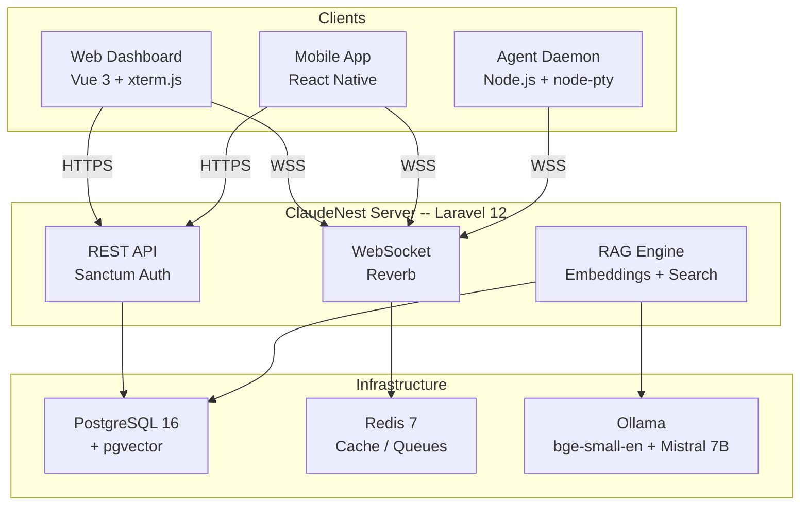

# ClaudeNest

**Remote Claude Code orchestration platform** -- control, coordinate, and scale Claude Code instances from anywhere.

<!-- Badges -->
[](LICENSE)
[](https://laravel.com)
[](https://vuejs.org)
[](https://reactnative.dev)
[](https://typescriptlang.org)

---

<!-- Screenshot placeholder -->
<!--
<p align="center">
  
</p>
-->

## What is ClaudeNest?

ClaudeNest turns Claude Code into a remotely accessible, multi-agent platform. Pair any machine running the agent daemon, then create and manage terminal sessions from a web dashboard or native mobile app. When multiple Claude instances work on the same project, ClaudeNest coordinates them through shared context (RAG), file locking, and an atomic task system.

---

## Features

### Remote Terminal Sessions
Real-time terminal access via xterm.js and WebSocket (Laravel Reverb). Full PTY support with resize, search, and WebGL rendering.

### Machine Pairing
Six-character pairing codes (`XXX-XXX`) generated by the agent. Enter the code in the dashboard or mobile app to link a machine instantly.

### Multi-Agent Orchestration
Run multiple Claude Code instances on the same project. Each instance can claim tasks, lock files, and share context without conflicts.

### Context RAG
pgvector-powered retrieval-augmented generation. Project context is embedded (384-dimensional vectors via `bge-small-en-v1.5`) and retrieved by semantic similarity so every instance has the right information.

### File Locking
Distributed file locks prevent two agents from editing the same file. Locks expire automatically and can be force-released when needed.

### Task Coordination
Atomic task claiming ensures no two instances pick up the same work. Tasks track status, dependencies, completion summaries, and modified files.

### Skills and MCP Servers
Discover, register, and toggle Claude Code skills per machine. Manage MCP (Model Context Protocol) servers and execute their tools remotely.

### Authentication
Magic link login, plus OAuth via Google and GitHub. Token-based API access for agents and integrations.

### Mobile Apps
Native iOS and Android apps built with React Native. Monitor machines, manage sessions, and coordinate agents on the go.

---

## Architecture



---

## Tech Stack

| Layer | Technology | Version |
|-------|-----------|---------|
| Backend | Laravel (PHP) | 12 (PHP 8.3+) |
| Frontend | Vue.js (Composition API, TypeScript) | 3.5 |
| Build | Vite + laravel-vite-plugin | 7.3 |
| State (Web) | Pinia | 2.3 |
| Terminal | xterm.js + WebGL addon | 5.5 |
| Styling | Tailwind CSS | 3.4 |
| WebSocket | Laravel Reverb | 1.x |
| Auth | Laravel Sanctum + Socialite | 4.x |
| Database | PostgreSQL + pgvector | 16+ |
| Cache/Queue | Redis | 7+ |
| Agent | Node.js + TypeScript + node-pty | 20 LTS |
| Mobile | React Native + Zustand | 0.83 |
| Embeddings | Ollama (bge-small-en-v1.5) | -- |
| Summarization | Ollama (Mistral 7B) | -- |

---

## Quick Start

### Prerequisites

- PHP 8.3+, Composer
- Node.js 20+, npm
- PostgreSQL 16+ with the `pgvector` extension
- Redis 7+
- Ollama (optional, for RAG features)

### Option A -- Docker

```bash
git clone https://github.com/QrCommunication/claudenest.git
cd claudenest

cp packages/server/.env.example packages/server/.env
docker compose up -d

docker compose exec server php artisan key:generate
docker compose exec server php artisan migrate
```

> See [docs/DEPLOYMENT-DOCKER.md](docs/DEPLOYMENT-DOCKER.md) for the full Docker guide.

### Option B -- Local development

```bash
git clone https://github.com/QrCommunication/claudenest.git
cd claudenest

# Server setup
cd packages/server
composer install
cp .env.example .env
php artisan key:generate
php artisan migrate

# Start everything (server, Vite, Reverb, queue worker)
composer dev
```

The `composer dev` script launches four processes in parallel:

| Process | URL |
|---------|-----|
| Laravel server | `http://localhost:8000` |
| Vite dev server | `http://localhost:5173` |
| Reverb WebSocket | `ws://localhost:8080` |
| Queue worker | (background) |

> See [docs/DEPLOYMENT-BAREMETAL.md](docs/DEPLOYMENT-BAREMETAL.md) for production setup.

### Agent setup

```bash
cd packages/agent
npm install
npm run dev
```

### Mobile setup

```bash
cd packages/mobile
npm install

# iOS
npm run pod-install
npm run ios

# Android
npm run android
```

---

## Project Structure

```
claudenest/
  packages/
    server/                   Laravel 12 + Vue 3 SPA
      app/
        Http/Controllers/Api/   REST API controllers
        Models/                 Eloquent models (UUID, pgvector)
        Services/               Business logic (RAG, MCP, Skills)
        Events/                 Broadcast events
      resources/js/             Vue 3 SPA
        components/             UI components by domain
        composables/            Vue composables
        pages/                  Page-level components
        stores/                 Pinia stores
      routes/
        api.php                 API routes
        channels.php            Broadcast channels
      database/migrations/      Schema migrations

    agent/                    Node.js daemon
      src/
        sessions/               PTY management
        websocket/              WebSocket client
        discovery/              Skills & MCP discovery
        context/                Context sync client

    mobile/                   React Native app
      src/
        screens/                App screens
        components/             Shared components
        stores/                 Zustand stores
        services/               API & WebSocket clients

  docs/                       Extended documentation
  scripts/                    Install & setup scripts
  branding/                   Logos, banners, brand guidelines
```

---

## API Reference

The most commonly used endpoints are listed below. For the full API reference, see [docs/API.md](docs/API.md).

### Authentication

| Method | Endpoint | Description |
|--------|----------|-------------|
| `POST` | `/api/auth/login` | Login with credentials |
| `POST` | `/api/auth/register` | Register new user |
| `GET` | `/api/auth/me` | Current user profile |
| `GET` | `/api/auth/{provider}/redirect` | OAuth redirect (google, github) |

### Machines

| Method | Endpoint | Description |
|--------|----------|-------------|
| `GET` | `/api/machines` | List paired machines |
| `POST` | `/api/machines` | Register a machine |
| `GET` | `/api/machines/{id}` | Machine details |
| `POST` | `/api/machines/{id}/regenerate-token` | Regenerate auth token |

### Sessions

| Method | Endpoint | Description |
|--------|----------|-------------|
| `POST` | `/api/machines/{id}/sessions` | Create terminal session |
| `POST` | `/api/sessions/{id}/input` | Send input to session |
| `POST` | `/api/sessions/{id}/resize` | Resize PTY |
| `DELETE` | `/api/sessions/{id}` | Terminate session |

### Multi-Agent (Projects, Tasks, Locks)

| Method | Endpoint | Description |
|--------|----------|-------------|
| `POST` | `/api/machines/{id}/projects` | Create shared project |
| `POST` | `/api/projects/{id}/context/query` | Semantic context search |
| `POST` | `/api/projects/{id}/tasks` | Create task |
| `POST` | `/api/tasks/{id}/claim` | Claim task (atomic) |
| `POST` | `/api/projects/{id}/locks` | Lock a file |
| `POST` | `/api/projects/{id}/locks/release` | Release file lock |

---

## Configuration

### Key environment variables (`packages/server/.env`)

```env
# Database (PostgreSQL + pgvector required)
DB_CONNECTION=pgsql
DB_HOST=127.0.0.1
DB_PORT=5432
DB_DATABASE=claudenest

# WebSocket (Laravel Reverb)
REVERB_APP_ID=claudenest
REVERB_APP_KEY=your-reverb-key
REVERB_APP_SECRET=your-reverb-secret
REVERB_SERVER_PORT=8080

# OAuth (optional)
GOOGLE_CLIENT_ID=
GOOGLE_CLIENT_SECRET=
GITHUB_CLIENT_ID=
GITHUB_CLIENT_SECRET=

# AI Models (optional, for RAG)
OLLAMA_HOST=http://localhost:11434
OLLAMA_EMBEDDING_MODEL=bge-small-en-v1.5
OLLAMA_SUMMARIZATION_MODEL=mistral:7b
```

See [docs/AI-MODELS.md](docs/AI-MODELS.md) for Ollama setup and model configuration.

### Agent configuration (`packages/agent/config.json`)

```json
{
  "serverUrl": "ws://localhost:8080",
  "machineToken": "mn_...",
  "claudePath": "/usr/local/bin/claude",
  "sessions": { "maxSessions": 10 }
}
```

---

## Development

### Server

```bash
cd packages/server

# Start all services
composer dev

# Run tests
php artisan test

# Lint PHP
./vendor/bin/pint

# Type-check Vue/TS
npm run typecheck
```

### Agent

```bash
cd packages/agent

npm run dev          # Watch mode
npm run build        # Compile TypeScript
npm run test         # Run tests
npm run typecheck    # Type check
```

### Mobile

```bash
cd packages/mobile

npm start            # Metro bundler
npm run ios          # Run on iOS simulator
npm run android      # Run on Android emulator
npm run typecheck    # Type check
```

---

## Deployment

Production deployment guides:

- **Docker**: [docs/DEPLOYMENT-DOCKER.md](docs/DEPLOYMENT-DOCKER.md)
- **Bare metal**: [docs/DEPLOYMENT-BAREMETAL.md](docs/DEPLOYMENT-BAREMETAL.md)
- **Domain setup**: [docs/DOMAINS.md](docs/DOMAINS.md)

An automated install script is available for Ubuntu/Debian servers:

```bash
./scripts/install-server.sh
```

---

## Documentation

| Document | Description |
|----------|-------------|
| [docs/ARCHITECTURE.md](docs/ARCHITECTURE.md) | System design and technical reference |
| [docs/API.md](docs/API.md) | Full API documentation |
| [docs/AI-MODELS.md](docs/AI-MODELS.md) | Ollama models and RAG configuration |
| [docs/DEPLOYMENT-DOCKER.md](docs/DEPLOYMENT-DOCKER.md) | Docker deployment guide |
| [docs/DEPLOYMENT-BAREMETAL.md](docs/DEPLOYMENT-BAREMETAL.md) | Bare-metal production setup |
| [docs/DOMAINS.md](docs/DOMAINS.md) | Domain and DNS configuration |
| [docs/CONTRIBUTING.md](docs/CONTRIBUTING.md) | Contribution guidelines |
| [branding/BRAND-GUIDELINES.md](branding/BRAND-GUIDELINES.md) | Brand identity and assets |

---

## Contributing

Contributions are welcome. Please read [docs/CONTRIBUTING.md](docs/CONTRIBUTING.md) before opening a pull request.

---

## License

This project is licensed under the [PolyForm Noncommercial License 1.0.0](LICENSE).

Copyright 2025 Rony Licha / QR Communication.
