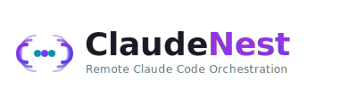

<div align="center">

<!-- Logo -->
<picture>
  <source media="(prefers-color-scheme: dark)" srcset="branding/logos/claudenest-logo-dark.svg">
  <source media="(prefers-color-scheme: light)" srcset="branding/logos/claudenest-logo-light.svg">
  
</picture>

<br><br>

<!-- Tagline -->
<h3>Remote Claude Code Orchestration</h3>
<p>Control Claude Code from anywhere. Collaborate with AI agents. Ship faster.</p>

<!-- Badges -->
<p>
  <a href="https://github.com/yourusername/claudenest/actions">
    
  </a>
  <a href="LICENSE">
    
  </a>
  <a href="https://github.com/yourusername/claudenest/releases">
    
  </a>
  <a href="https://discord.gg/claudenest">
    
  </a>
</p>

<!-- Quick Links -->
<p>
  <a href="#-what-is-claudenest">What is ClaudeNest</a> •
  <a href="#-features">Features</a> •
  <a href="#-quick-start">Quick Start</a> •
  <a href="#-architecture">Architecture</a> •
  <a href="#-documentation">Docs</a>
</p>

</div>

---

## ✨ What is ClaudeNest?

**ClaudeNest** is your remote control center for Claude Code. Whether you're on your phone, tablet, or a different computer, stay connected to your AI coding assistant running on your main machine.

### The Problem We Solve

```
❌ "I'm on my laptop at a café but Claude Code is on my desktop at home"
❌ "My team wants to collaborate on the same Claude Code session"
❌ "I need to check what Claude did while I was away"
✅ ClaudeNest solves all of this
```

### What You Get

| Feature | Benefit |
|---------|---------|
| 🌐 **Remote Access** | Control Claude Code from any device, anywhere |
| 👥 **Multi-Agent** | Run multiple Claude instances collaborating on the same project |
| 🧠 **Smart Context** | RAG-powered memory so Claude never loses context |
| 📱 **Mobile App** | iOS & Android apps for on-the-go management |
| 🔒 **Secure by Default** | End-to-end encryption, OAuth, machine tokens |
| 🤖 **Local AI Models** | Self-hosted Ollama integration for complete privacy |

---

## 🚀 Features

### Core Capabilities

<table>
<tr>
<td width="50%">

#### 🔐 Secure Remote Access
SSH-like security with machine tokens, OAuth integration, and end-to-end encryption. Your code stays private.

</td>
<td width="50%">

#### ⚡ Real-Time Collaboration
WebSocket-powered live terminal streaming. See what Claude is doing as it happens.

</td>
</tr>
<tr>
<td width="50%">

#### 🧠 AI Context Management (RAG)
Powered by PostgreSQL + pgvector. Claude remembers everything across sessions with intelligent retrieval.

</td>
<td width="50%">

#### 📱 Mobile Companion App
Native iOS & Android apps built with React Native. Start tasks, monitor progress, receive notifications.

</td>
</tr>
<tr>
<td width="50%">

#### 🤖 Local AI Models (Ollama)
Run Mistral 7B, embeddings, and reranking models locally. Zero API costs, complete privacy.

</td>
<td width="50%">

#### 🔧 Skills & MCP Support
Full Claude Code skills ecosystem with Model Context Protocol integration.

</td>
</tr>
</table>

### Multi-Agent Collaboration 🎯

```
┌─────────────────────────────────────────────────────────────┐
│  Project: MyApp                                              │
├─────────────────────────────────────────────────────────────┤
│  🤖 Claude-1  →  Feature: Auth System     [Active]          │
│  🤖 Claude-2  →  Feature: API Endpoints   [Active]          │
│  🤖 Claude-3  →  Feature: UI Components   [Waiting]         │
│  🤖 Claude-4  →  Feature: Tests           [Idle]            │
├─────────────────────────────────────────────────────────────┤
│  Shared Context: 2,847 chunks indexed                       │
│  File Locks: 3 active                                       │
└─────────────────────────────────────────────────────────────┘
```

---

## 📸 Screenshots & Demo

<details open>
<summary><b>🖥️ Web Dashboard</b></summary>
<br>

<p align="center">
  
  <br>
  <em>Full-featured web dashboard with terminal, file explorer, and activity timeline</em>
</p>

</details>

<details>
<summary><b>📱 Mobile Companion App</b></summary>
<br>

<p align="center">
  
  <br>
  <em>Native iOS & Android apps for managing Claude on the go</em>
</p>

</details>

<details>
<summary><b>🎬 Demo Video</b></summary>
<br>

<p align="center">
  <a href="https://www.youtube.com/watch?v=claudenest-demo">
    
  </a>
  <br>
  <em>Watch the 3-minute demo showcasing remote access and multi-agent collaboration</em>
</p>

</details>

---

## 🚦 Quick Start

### Prerequisites

- **Server**: Ubuntu 22.04+ or Docker-capable host (4GB+ RAM)
- **Agent Machine**: macOS or Linux with Claude Code installed
- **Client**: Any modern browser or iOS/Android device

### Option 1: Docker Compose (Easiest) ★

```bash
# Clone the repository
git clone https://github.com/yourusername/claudenest.git
cd claudenest

# Configure environment
cp .env.example .env
# Edit .env with your settings

# Start all services
docker-compose -f docker-compose.prod.yml up -d

# View logs
docker-compose logs -f
```

Access the dashboard at `http://localhost:8080`

### Option 2: Bare-Metal Installation (Production)

```bash
# Automated installation script
curl -fsSL https://claudenest.dev/install.sh | bash

# Or manual installation
git clone https://github.com/yourusername/claudenest.git /opt/claudenest
cd /opt/claudenest
./scripts/install-server.sh
```

### Connect Your First Agent

```bash
# On your local machine with Claude Code
cd /path/to/your/project

# Install and run the agent
npx @claude-remote/agent init
npx @claude-remote/agent start

# Or with Docker
docker run -d \
  --name claudenest-agent \
  -v $(pwd):/workspace \
  -e CLAUDENEST_SERVER=wss://your-server.com \
  claudenest/agent:latest
```

### Verify Installation

```bash
# Check server health
curl http://localhost:8080/health

# List connected agents
claudenest-cli agents list

# Connect via mobile app
# Download from App Store or Google Play
```

---

## 🏗️ Architecture

### System Overview

```
┌─────────────────────────────────────────────────────────────────────────────┐
│                              CLIENTS                                         │
├─────────────┐  ┌─────────────┐  ┌─────────────┐  ┌─────────────────────────┐│
│  📱 Mobile  │  │  🌐 Web     │  │  💻 Desktop │  │  🤖 AI Models (Ollama)  ││
│ iOS/Android │  │  Dashboard  │  │   Agent     │  │  Mistral 7B | Embeddings││
└──────┬──────┘  └──────┬──────┘  └──────┬──────┘  └─────────────────────────┘│
       │                │                │                                    │
       └────────────────┼────────────────┘                                    │
                        │                                                    │
                        ▼                                                    │
       ┌────────────────────────────────────┐                                │
       │     🔌 WebSocket Gateway           │                                │
       │        (Laravel Reverb)            │                                │
       └────────────────┬───────────────────┘                                │
                        │                                                    │
                        ▼                                                    │
       ┌────────────────────────────────────┐                                │
       │     🖥️  ClaudeNest Server          │◄───────────────────────────────┤
       │     Laravel 11 | Vue.js 3 | RAG    │                                │
       └────────────────┬───────────────────┘                                │
                        │                                                    │
           ┌────────────┼────────────┐                                       │
           ▼            ▼            ▼                                       │
       ┌────────┐  ┌────────┐  ┌──────────┐                                  │
       │PostgreSQL│  │ Redis  │  │  Meilisearch│                              │
       │+pgvector│  │ Cache  │  │   Search    │                              │
       └────────┘  └────────┘  └──────────┘                                  │
└─────────────────────────────────────────────────────────────────────────────┘
```

### Technology Stack

| Layer | Technology | Purpose |
|-------|------------|---------|
| **Frontend** |  | Web dashboard UI |
| **Backend** |  | API & WebSocket relay |
| **Real-time** |  | WebSocket broadcasting |
| **Database** |  | Data + pgvector RAG |
| **Cache** |  | Session & cache |
| **Search** | Meilisearch | Full-text search |
| **Mobile** |  | iOS & Android apps |
| **Agent** |  | Local PTY daemon |
| **AI** |  | Local LLM inference |

---

## 📚 Documentation

| Document | Description |
|----------|-------------|
| 📘 [Full Documentation](/docs) | Complete user and developer guides |
| 🔧 [API Reference](packages/server/docs/API.md) | REST API and WebSocket endpoints |
| 🐳 [Docker Deployment](docs/DEPLOYMENT-DOCKER.md) | Container setup and configuration |
| 🖥️ [Bare-Metal Deployment](docs/DEPLOYMENT-BAREMETAL.md) | Production server installation |
| 🤖 [AI Models Setup](docs/AI-MODELS.md) | Ollama and LLM configuration |
| 🎨 [Architecture Visual](ARCHITECTURE-VISUELLE.md) | System diagrams and flows |
| 🗺️ [Project Roadmap](ORCHESTRATION-CLAUDENEST.md) | Complete development roadmap |
| 🤝 [Contributing](CONTRIBUTING.md) | How to contribute to the project |

---

## 🛠️ Development

```bash
# Clone repository
git clone https://github.com/yourusername/claudenest.git
cd claudenest

# Install dependencies
npm install
composer install

# Start development environment
docker-compose up -d

# Run migrations
php artisan migrate

# Seed database
php artisan db:seed

# Start dev servers
npm run dev        # Vite dev server
php artisan serve  # Laravel dev server
```

See [Contributing Guide](CONTRIBUTING.md) for detailed development setup.

---

## 🤝 Contributing

We welcome contributions from the community! Here's how to get involved:

### Ways to Contribute

- 🐛 **Bug Reports** - Found a bug? Open an issue with reproduction steps
- 💡 **Feature Requests** - Have an idea? We'd love to hear it
- 📝 **Documentation** - Help improve our docs
- 🔧 **Code** - Submit PRs for bugs or features
- 🧪 **Testing** - Help test new releases

### Quick Contribution Guide

```bash
# Fork and clone
gh repo fork yourusername/claudenest --clone=true
cd claudenest

# Create feature branch
git checkout -b feature/my-feature

# Make changes and commit
git add .
git commit -m "feat: add my feature"

# Push and create PR
git push origin feature/my-feature
gh pr create --title "feat: my feature"
```

### Code of Conduct

This project follows the [Contributor Covenant Code of Conduct](CODE_OF_CONDUCT.md). By participating, you agree to uphold this code.

---

## 🎨 Brand Colors

| Color | Hex | Usage |
|-------|-----|-------|
| Primary | `#a855f7` | Purple - Buttons, brand identity |
| Indigo | `#6366f1` | Gradients, accents |
| Cyan | `#22d3ee` | Highlights, links |
| Dark 1 | `#0f0f1a` | Deepest background |
| Dark 2 | `#1a1b26` | Primary background |
| Dark 3 | `#24283b` | Cards, surfaces |

---

## 🤖 Self-Hosted AI Models

ClaudeNest uses open-source AI models for complete privacy:

| Model | Purpose | Size | RAM |
|-------|---------|------|-----|
| **bge-small-en-v1.5** | Embeddings | 130 MB | ~1 GB |
| **Mistral 7B Q4** | Summarization | 4.4 GB | ~6 GB |
| **bge-reranker-base** | Reranking | 278 MB | ~1 GB |

**Total RAM:** ~8 GB (can run on CPU)

**Cost:** 0€ - All models are open-source via Ollama

---

## 📄 License

ClaudeNest is open-source software licensed under the [MIT License](LICENSE).

```
MIT License

Copyright (c) 2025 ClaudeNest Contributors

Permission is hereby granted, free of charge, to any person obtaining a copy
of this software and associated documentation files (the "Software"), to deal
in the Software without restriction, including without limitation the rights
to use, copy, modify, merge, publish, distribute, sublicense, and/or sell
copies of the Software, and to permit persons to whom the Software is
furnished to do so, subject to the following conditions:

[See LICENSE for full text]
```

---

## 🙏 Acknowledgments

ClaudeNest wouldn't exist without these amazing projects:

- **[Claude Code](https://www.anthropic.com/claude-code)** by [Anthropic](https://www.anthropic.com) - The AI assistant that makes everything possible
- **[Laravel](https://laravel.com)** - The PHP framework for web artisans
- **[Vue.js](https://vuejs.org)** - The progressive JavaScript framework
- **[Ollama](https://ollama.ai)** - Run LLMs locally with ease
- **[PostgreSQL](https://www.postgresql.org)** - The world's most advanced open source database
- **[React Native](https://reactnative.dev)** - Build native mobile apps with React

---

<div align="center">

### Made with 💜 by the ClaudeNest Team

[Website](https://claudenest.dev) • [Documentation](https://docs.claudenest.dev) • [Discord](https://discord.gg/claudenest) • [Twitter](https://twitter.com/claudenest)

</div>
