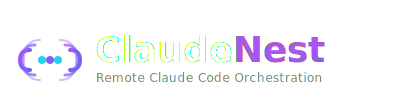

# 🎯 ClaudeNest

<p align="center">
  
</p>

<p align="center">
  <strong>Remote Claude Code Orchestration Platform</strong>
</p>

<p align="center">
  <a href="#features">Features</a> •
  <a href="#architecture">Architecture</a> •
  <a href="#deployment">Deployment</a> •
  <a href="#documentation">Documentation</a>
</p>

---

## 🚀 Features

### Core
- 🔗 **Remote Access** - Control Claude Code from anywhere
- 📱 **Mobile App** - iOS & Android native apps
- 🌐 **Web Dashboard** - Full terminal with xterm.js
- 🔐 **Secure** - OAuth, machine tokens, E2E encryption

### Multi-Agent (Unique)
- 🤖 **Parallel Claude Instances** - Run multiple Claudes on same project
- 🧠 **Shared Context** - RAG-powered with pgvector
- 📋 **Task Coordination** - Atomic task claiming
- 🔒 **File Locking** - Prevent conflicts
- 📊 **Activity Timeline** - Track all instances

## 🏗️ Architecture

```
┌─────────────┐     ┌─────────────┐     ┌─────────────┐
│   Mobile    │     │    Web      │     │    Agent    │
│  iOS/Android│     │   Dashboard │     │  Local Mac  │
└──────┬──────┘     └──────┬──────┘     └──────┬──────┘
       │                   │                   │
       └───────────────────┼───────────────────┘
                           │
              ┌────────────┴────────────┐
              │   ClaudeNest Server     │
              │  Laravel + Reverb + RAG │
              └────────────┬────────────┘
                           │
        ┌──────────────────┼──────────────────┐
        ▼                  ▼                  ▼
   ┌─────────┐       ┌─────────┐       ┌─────────┐
   │PostgreSQL│       │  Redis  │       │ Ollama  │
   │+pgvector│       │ (Cache) │       │Mistral7B│
   └─────────┘       └─────────┘       └─────────┘
```

## 📦 Packages

| Package | Tech | Description |
|---------|------|-------------|
| `@claude-remote/server` | Laravel 11, Vue.js 3 | Backend API, WebSocket relay, Web dashboard |
| `@claude-remote/agent` | Node.js, TypeScript | Local daemon, PTY management |
| `@claude-remote/mobile` | React Native, Zustand | iOS & Android apps |

## 🚀 Quick Start (Development)

### Prerequisites
- Node.js 20+
- PHP 8.3+
- Docker & Docker Compose
- Composer

```bash
git clone https://github.com/yourusername/claudenest.git
cd claudenest
cp .env.example .env
docker-compose up -d
```

See [Development Guide](#development) for details.

---

## 🖥️ Deployment Options

ClaudeNest supports two deployment modes:

### Option 1: Docker Compose (Recommended for Development)

Quick setup with all services containerized.

```bash
cd /opt/claudenest
docker-compose -f docker-compose.prod.yml up -d
```

**Pros:**
- Easy setup
- Isolated environments
- Simple upgrades

**Cons:**
- Overhead of containers
- Less control over individual services

[→ Docker Deployment Guide](docs/DEPLOYMENT-DOCKER.md)

### Option 2: Bare-Metal / VPS (Recommended for Production)

Direct installation on Ubuntu/Debian server for optimal performance.

```bash
# Automated installation
curl -fsSL https://claudenest.dev/install.sh | bash

# Or manual installation
cd /opt
sudo git clone https://github.com/yourusername/claudenest.git
sudo chown -R $USER:$USER claudenest

# Run installer
./scripts/install-server.sh
```

**Pros:**
- Maximum performance (no container overhead)
- Direct hardware access (GPU for LLMs)
- Easier debugging
- Better resource control

**Cons:**
- More complex initial setup
- Manual dependency management

**Recommended for:** Production servers with dedicated resources (e.g., EM-A410X-SSD)

[→ Bare-Metal Deployment Guide](docs/DEPLOYMENT-BAREMETAL.md)

---

## 🎨 Brand Colors

| Color | Hex | Usage |
|-------|-----|-------|
| Primary | `#a855f7` | Purple - Buttons, brand |
| Indigo | `#6366f1` | Gradients, accents |
| Cyan | `#22d3ee` | Highlights, links |
| Dark 1 | `#0f0f1a` | Deepest background |
| Dark 2 | `#1a1b26` | Primary background |
| Dark 3 | `#24283b` | Cards, surfaces |

---

## 🤖 AI Models (Self-Hosted)

ClaudeNest uses open-source AI models for RAG (Retrieval-Augmented Generation):

| Model | Purpose | Size | RAM |
|-------|---------|------|-----|
| **bge-small-en-v1.5** | Embeddings | 130 MB | 1 GB |
| **Mistral 7B Q4** | Summarization | 4.4 GB | 6 GB |
| **bge-reranker-base** | Reranking (optional) | 278 MB | 1 GB |

**Total RAM for AI:** ~8 GB (can run on CPU)

**Cost:** 0€ - All models are open-source and run locally via Ollama.

---

## 📚 Documentation

- [Architecture Visuelle](ARCHITECTURE-VISUELLE.md) - Diagrams & flows
- [Orchestration Complete](ORCHESTRATION-CLAUDENEST.md) - Full project plan
- [Docker Deployment](docs/DEPLOYMENT-DOCKER.md) - Docker Compose setup
- [Bare-Metal Deployment](docs/DEPLOYMENT-BAREMETAL.md) - Production server setup
- [AI Models Setup](docs/AI-MODELS.md) - LLM installation & configuration
- [API Documentation](packages/server/docs/API.md) - API reference

---

## 🤝 Contributing

See [Contributing Guide](CONTRIBUTING.md)

## 📄 License

MIT License - see [LICENSE](LICENSE)

---

<p align="center">
  Made with 💜 by the ClaudeNest Team
</p>
