# ClaudeNest Architecture Documentation

> **The definitive technical reference for ClaudeNest's system design**

---

## Table of Contents

1. [System Overview](#1-system-overview)
2. [Backend Architecture (Laravel)](#2-backend-architecture-laravel)
3. [Frontend Architecture (Vue.js)](#3-frontend-architecture-vuejs)
4. [Database Design](#4-database-design)
5. [Real-time Communication](#5-real-time-communication)
6. [Security](#6-security)
7. [Deployment](#7-deployment)

---

## 1. System Overview

### 1.1 High-Level Architecture

ClaudeNest is a distributed system enabling remote orchestration of Claude Code instances across multiple machines, with real-time collaboration and RAG-powered context sharing.

```mermaid
flowchart TB
    subgraph Clients["🌐 Clients"]
        Web["Web Dashboard<br/>Vue.js + xterm.js"]
        Mobile["Mobile App<br/>React Native"]
        Agent["Agent Daemon<br/>Node.js/TypeScript"]
    end

    subgraph Edge["☁️ Edge Layer"]
        CDN["Cloudflare CDN<br/>(DDoS + SSL)"]
    end

    subgraph Server["🖥️ ClaudeNest Server"]
        Nginx["NGINX<br/>Reverse Proxy"]
        Laravel["Laravel API<br/>PHP 8.3+ / Laravel 12"]
        Reverb["Laravel Reverb<br/>WebSocket Server"]
        VueAssets["Vue.js SPA<br/>Static Assets"]
    end

    subgraph Services["🔧 Shared Services"]
        Postgres[("PostgreSQL<br/>+ pgvector")]
        Redis[("Redis<br/>Cache & Pub/Sub")]
        Ollama["Ollama<br/>Mistral 7B"]
    end

    Web --> CDN
    Mobile --> CDN
    Agent --> CDN
    CDN --> Nginx
    
    Nginx --> Laravel
    Nginx --> Reverb
    Nginx --> VueAssets
    
    Laravel --> Postgres
    Laravel --> Redis
    Laravel --> Ollama
    Reverb --> Redis
```



### 1.2 Component Interaction


### 1.3 Machine Pairing Flow

When an agent is installed on a new machine, it must be paired with a user account. ClaudeNest uses a 6-character pairing code (XXX-XXX format) with a 10-minute TTL, eliminating the need to handle credentials on the agent side.


### 1.4 Data Flow


---

## 2. Backend Architecture (Laravel)

### 2.1 Directory Structure

```
app/
├── Broadcasting/           # Broadcast channels authorization
├── Console/               # Artisan commands
│   └── Commands/
├── Events/                # Broadcast & domain events
├── Exceptions/            # Exception handlers
├── Http/
│   ├── Controllers/
│   │   ├── Api/          # API controllers
│   │   └── Web/          # Web dashboard controllers
│   ├── Middleware/       # Request middleware
│   ├── Requests/         # Form request validation
│   └── Resources/        # API response transformers
├── Models/               # Eloquent models
├── Policies/             # Authorization policies
├── Providers/            # Service providers
└── Services/             # Business logic services
```

### 2.2 Layer Responsibilities


### 2.3 Controllers Layer

Controllers handle HTTP requests and delegate business logic to Services:

| Controller | Responsibility |
|------------|----------------|
| `AuthController` | OAuth, login, token management |
| `MachineController` | Machine registration, status, tokens |
| `SessionController` | PTY session lifecycle |
| `ProjectController` | Multi-agent project management |
| `TaskController` | Task claiming, completion |
| `ContextController` | RAG context queries |
| `FileLockController` | Distributed file locking |
| `SkillsController` | Skill management |
| `MCPController` | MCP server management |
| `PairingController` | Machine pairing via 6-char codes |

```php
// Example: MachineController flow
class MachineController extends Controller
{
    public function store(StoreMachineRequest $request): JsonResponse
    {
        // 1. Request validated by StoreMachineRequest
        // 2. Business logic executed
        // 3. Response transformed by MachineResource
    }
}
```

### 2.4 Services Layer

Services contain pure business logic, decoupled from HTTP:


### 2.5 Models Layer

Eloquent models define data structure and relationships:


### 2.6 Events Layer

Events enable real-time communication:

```mermaid
flowchart TB
    subgraph Events["Laravel Events"]
        SessionEvents["Session Events
• SessionCreated
• SessionInput
• SessionOutput
• SessionResize
• SessionTerminated"]
        
        TaskEvents["Task Events
• TaskCreated
• TaskClaimed
• TaskReleased
• TaskCompleted"]
        
        LockEvents["Lock Events
• FileLocked
• FileUnlocked"]
        
        ProjectEvents["Project Events
• ProjectBroadcast"]
    end

    subgraph Broadcasting["Broadcast Channels"]
        PrivateUser["private-user.{id}"]
        PrivateSession["private-session.{id}"]
        PrivateProject["private-project.{id}"]
    end

    SessionEvents --> PrivateSession
    SessionEvents --> PrivateUser
    TaskEvents --> PrivateProject
    LockEvents --> PrivateProject
    ProjectEvents --> PrivateProject
```



---

## 3. Frontend Architecture (Vue.js)

### 3.1 Directory Structure

```
resources/js/
├── components/           # Reusable Vue components
│   ├── common/          # UI primitives (Button, Input, etc.)
│   ├── terminal/        # Terminal-specific components
│   ├── machines/        # Machine management
│   ├── projects/        # Project & multi-agent
│   ├── sessions/        # Session management
│   ├── skills/          # Skills configuration
│   └── layout/          # Layout components
├── pages/               # Route-level components
│   ├── sessions/
│   ├── projects/
│   ├── machines/
│   └── ...
├── stores/              # Pinia state management
├── composables/         # Reusable composition functions
├── services/            # API & WebSocket clients
├── router/              # Vue Router configuration
├── types/               # TypeScript type definitions
└── utils/               # Utility functions
```

### 3.2 Component Hierarchy

```mermaid
flowchart TB
    subgraph App["App.vue"]
        Router["Vue Router"]
    end

    subgraph Layouts["Layouts"]
        Dashboard["DashboardLayout
• Sidebar
• Header
• UserMenu"]
        Docs["DocsLayout
• Sidebar
• TOC"]
    end

    subgraph Pages["Pages"]
        SessionsPage["Sessions/Index.vue"]
        TerminalPage["Sessions/Terminal.vue"]
        ProjectsPage["Projects/Index.vue"]
        ProjectShow["Projects/Show.vue"]
    end

    subgraph Components["Components"]
        Terminal["XtermTerminal.vue"]
        SessionCard["SessionCard.vue"]
        TaskCard["TaskCard.vue"]
        InstanceCard["InstanceCard.vue"]
        ContextPanel["ContextPanel.vue"]
    end

    Router --> Dashboard
    Router --> Docs
    Dashboard --> SessionsPage
    Dashboard --> TerminalPage
    Dashboard --> ProjectsPage
    Dashboard --> ProjectShow
    SessionsPage --> SessionCard
    TerminalPage --> Terminal
    ProjectShow --> TaskCard
    ProjectShow --> InstanceCard
    ProjectShow --> ContextPanel
```



### 3.3 State Management (Pinia)

```mermaid
flowchart LR
    subgraph Stores["Pinia Stores"]
        Auth["auth.ts
• user
• token
• login/logout"]
        
        Machines["machines.ts
• machines list
• current machine
• CRUD operations"]
        
        Sessions["sessions.ts
• sessions list
• active session
• terminal state"]
        
        Projects["projects.ts
• projects list
• current project
• stats"]
        
        Tasks["tasks.ts
• tasks list
• kanban board
• claim/release"]
        
        Context["context.ts
• RAG results
• search query
• chunks"]
        
        Locks["locks.ts
• active locks
• lock/unlock"]
        
        Skills["skills.ts
• skills list
• enabled/disabled"]
        
        MCP["mcp.ts
• servers list
• tools registry"]
    end

    subgraph Components["Components"]
        UI["UI Components"]
    end

    subgraph API["API Layer"]
        ApiClient["api.ts"]
        WsClient["websocket.ts"]
    end

    Auth --> UI
    Machines --> UI
    Sessions --> UI
    Projects --> UI
    Tasks --> UI
    Context --> UI
    Locks --> UI
    Skills --> UI
    MCP --> UI
    
    Auth --> ApiClient
    Machines --> ApiClient
    Sessions --> ApiClient
    Projects --> ApiClient
    Tasks --> ApiClient
    
    Sessions --> WsClient
    Context --> WsClient
    Locks --> WsClient
```



### 3.4 Routing Architecture


### 3.5 API Communication


---

## 4. Database Design

### 4.1 Entity Relationship Diagram

```mermaid
erDiagram
    USERS {
        uuid id PK
        string email UK
        string name
        string password
        string avatar_url
        string google_id UK
        string github_id UK
        timestamp email_verified_at
        timestamps
    }

    MACHINES {
        uuid id PK
        uuid user_id FK
        string name
        string token_hash
        string platform
        string hostname
        string arch
        string node_version
        string agent_version
        string claude_version
        string claude_path
        string status
        json capabilities
        int max_sessions
        timestamp last_seen_at
        timestamp connected_at
        timestamps
    }

    CLAUDE_SESSIONS {
        uuid id PK
        uuid machine_id FK
        uuid user_id FK
        string mode
        string project_path
        text initial_prompt
        string status
        int pid
        int exit_code
        json pty_size
        int total_tokens
        decimal total_cost
        timestamp started_at
        timestamp completed_at
        timestamps
    }

    SESSION_LOGS {
        uuid id PK
        uuid session_id FK
        string type
        text data
        json metadata
        timestamps
    }

    SHARED_PROJECTS {
        uuid id PK
        uuid user_id FK
        uuid machine_id FK
        string name
        string project_path UK
        text summary
        text architecture
        text conventions
        text current_focus
        text recent_changes
        int total_tokens
        int max_tokens
        json settings
        timestamps
    }

    CONTEXT_CHUNKS {
        uuid id PK
        uuid project_id FK
        text content
        string type
        vector_384 embedding
        string instance_id
        string task_id
        json files
        float importance_score
        timestamp expires_at
        timestamps
    }

    SHARED_TASKS {
        uuid id PK
        uuid project_id FK
        string title
        text description
        string priority
        string status
        string assigned_to
        timestamp claimed_at
        json dependencies
        string blocked_by
        json files
        int estimated_tokens
        timestamp completed_at
        text completion_summary
        json files_modified
        string created_by
        timestamps
    }

    CLAUDE_INSTANCES {
        string id PK
        uuid project_id FK
        uuid session_id FK
        uuid machine_id FK
        string status
        string current_task_id FK
        int context_tokens
        int max_context_tokens
        int tasks_completed
        timestamp connected_at
        timestamp last_activity_at
        timestamp disconnected_at
    }

    FILE_LOCKS {
        uuid id PK
        uuid project_id FK
        string path
        string locked_by
        string reason
        timestamp locked_at
        timestamp expires_at
        timestamps
    }

    ACTIVITY_LOGS {
        uuid id PK
        uuid project_id FK
        string instance_id
        string type
        json details
        timestamps
    }

    PERSONAL_ACCESS_TOKENS {
        uuid id PK
        uuid user_id FK
        string name
        string token_hash
        json abilities
        timestamp last_used_at
        timestamp expires_at
        timestamp revoked_at
        timestamps
    }

    PAIRING_CODES {
        uuid id PK
        string code UK
        uuid machine_id FK nullable
        uuid user_id FK nullable
        string agent_token_hash
        json agent_info
        timestamp expires_at
        timestamp completed_at
        timestamps
    }

    USERS ||--o{ MACHINES : owns
    USERS ||--o{ CLAUDE_SESSIONS : creates
    USERS ||--o{ PERSONAL_ACCESS_TOKENS : has
    USERS ||--o{ SHARED_PROJECTS : owns
    
    MACHINES ||--o{ CLAUDE_SESSIONS : hosts
    MACHINES ||--o{ CLAUDE_INSTANCES : runs
    MACHINES ||--o{ SHARED_PROJECTS : manages
    
    SHARED_PROJECTS ||--o{ CONTEXT_CHUNKS : contains
    SHARED_PROJECTS ||--o{ SHARED_TASKS : tracks
    SHARED_PROJECTS ||--o{ FILE_LOCKS : manages
    SHARED_PROJECTS ||--o{ CLAUDE_INSTANCES : coordinates
    SHARED_PROJECTS ||--o{ ACTIVITY_LOGS : records
    
    CLAUDE_SESSIONS ||--o{ SESSION_LOGS : generates
    CLAUDE_SESSIONS ||--o| CLAUDE_INSTANCES : spawns
    SHARED_TASKS ||--o| CLAUDE_INSTANCES : assigned_to

    USERS ||--o{ PAIRING_CODES : initiates
    MACHINES ||--o| PAIRING_CODES : created_via
```

### 4.2 Table Descriptions

| Table | Purpose | Key Features |
|-------|---------|--------------|
| `users` | User accounts | OAuth support (Google/GitHub), UUID PKs |
| `machines` | Registered machines | Token-based auth, capabilities tracking |
| `claude_sessions` | PTY sessions | Status tracking, PTY size, token counting |
| `session_logs` | Session output history | Stores terminal I/O |
| `shared_projects` | Multi-agent projects | Context management, settings JSON |
| `context_chunks` | RAG vector store | pgvector 384-dim embeddings |
| `shared_tasks` | Task queue | Atomic claiming, dependencies |
| `claude_instances` | Active Claude processes | Real-time status, context tracking |
| `file_locks` | Distributed locks | Auto-expiring, conflict prevention |
| `activity_logs` | Audit trail | Project activity tracking |

### 4.3 Indexing Strategy

```sql
-- Primary lookup indexes
CREATE INDEX idx_machines_user_id ON machines(user_id);
CREATE INDEX idx_machines_status ON machines(status);
CREATE INDEX idx_sessions_machine_id ON claude_sessions(machine_id);
CREATE INDEX idx_sessions_status ON claude_sessions(status);

-- Multi-agent indexes
CREATE INDEX idx_context_chunks_project_id ON context_chunks(project_id);
CREATE INDEX idx_context_chunks_type ON context_chunks(type);
CREATE INDEX idx_context_chunks_expires ON context_chunks(expires_at);
CREATE INDEX idx_tasks_project_id ON shared_tasks(project_id);
CREATE INDEX idx_tasks_status ON shared_tasks(status);
CREATE INDEX idx_tasks_assigned ON shared_tasks(assigned_to);
CREATE INDEX idx_file_locks_project ON file_locks(project_id);
CREATE INDEX idx_file_locks_path ON file_locks(project_id, path);
CREATE INDEX idx_activity_project ON activity_logs(project_id);

-- pgvector index (IVFFlat for approximate search)
CREATE INDEX idx_context_chunks_embedding ON context_chunks 
    USING ivfflat (embedding vector_cosine_ops) 
    WITH (lists = 100);
```

### 4.4 pgvector Usage


```php
// Vector similarity search example
$embeddingStr = '[' . implode(',', $embedding) . ']';

$chunks = ContextChunk::forProject($projectId)
    ->active()
    ->selectRaw("
        *,
        embedding <=> '{$embeddingStr}'::vector AS distance,
        1 - (embedding <=> '{$embeddingStr}'::vector) AS similarity
    ")
    ->orderBy('distance', 'asc')
    ->limit(10)
    ->get();
```

---

## 5. Real-time Communication

### 5.1 WebSocket Flow


### 5.2 Event Broadcasting

```mermaid
flowchart TB
    subgraph Events["Broadcast Events"]
        SessionCreated["SessionCreated
• Dispatched on: session:create"]
        SessionOutput["SessionOutput
• Dispatched on: agent output"]
        TaskClaimed["TaskClaimed
• Dispatched on: task:claim"]
        FileLocked["FileLocked
• Dispatched on: lock:acquire"]
    end

    subgraph Channels["Private Channels"]
        UserChannel["private-user.{userId}
• Machine status
• Session events"]
        SessionChannel["private-session.{sessionId}
• Terminal I/O
• Resize events"]
        ProjectChannel["private-project.{projectId}
• Task updates
• File locks
• Instance status"]
    end

    SessionCreated --> UserChannel
    SessionOutput --> SessionChannel
    TaskClaimed --> ProjectChannel
    FileLocked --> ProjectChannel
```



### 5.3 Laravel Reverb Configuration

```php
// config/reverb.php
return [
    'default' => env('REVERB_SERVER', 'reverb'),
    
    'servers' => [
        'reverb' => [
            'host' => env('REVERB_HOST', '0.0.0.0'),
            'port' => env('REVERB_PORT', 8080),
            'hostname' => env('REVERB_HOSTNAME', 'localhost'),
            'options' => [
                'tls' => [],
            ],
            'max_request_size' => 10_000_000,
            'scaling' => [
                'enabled' => env('REVERB_SCALING_ENABLED', false),
                'channel' => env('REVERB_SCALING_CHANNEL', 'reverb'),
            ],
        ],
    ],
    
    'apps' => [
        'provider' => 'config',
        'apps' => [
            [
                'key' => env('REVERB_APP_KEY'),
                'secret' => env('REVERB_APP_SECRET'),
                'app_id' => env('REVERB_APP_ID'),
                'options' => [
                    'host' => env('REVERB_HOST'),
                    'port' => env('REVERB_PORT', 8080),
                    'scheme' => env('REVERB_SCHEME', 'https'),
                    'useTLS' => env('REVERB_SCHEME', 'https') === 'https',
                ],
            ],
        ],
    ],
];
```

---

## 6. Security

### 6.1 Authentication Flow


### 6.2 Authorization Layers

```mermaid
flowchart TB
    subgraph AuthLayers["Authorization Layers"]
        Middleware["1. Middleware Layer
• auth:sanctum
• EnsureMachineOwner
• RateLimitApi"]
        
        Gates["2. Gates & Policies
• ProjectPolicy
• MachinePolicy"]
        
        Ownership["3. Ownership Checks
• User owns resource
• Machine belongs to user"]
        
        Scopes["4. Token Scopes
• abilities: ['*']
• Limited scope tokens"]
    end

    Request["Incoming Request"] --> Middleware
    Middleware --> Gates
    Gates --> Ownership
    Ownership --> Scopes
    Scopes --> Handler["Request Handler"]
```



### 6.3 Token Management

| Token Type | Purpose | Storage | Expiry |
|------------|---------|---------|--------|
| `Personal Access Token` | User API access | Database (hashed) | 30 days default |
| `Machine Token` | Agent authentication | Database (SHA-256) | Per-machine |
| `WebSocket Token` | WS connection | Short-lived JWT | 5 minutes |
| `OAuth Token` | Social auth | Session only | Provider-defined |

### 6.4 CORS Configuration

```php
// config/cors.php
return [
    'paths' => ['api/*', 'sanctum/csrf-cookie'],
    'allowed_methods' => ['*'],
    'allowed_origins' => [
        env('FRONTEND_URL', 'http://localhost:5173'),
        'https://app.claudenest.io',
    ],
    'allowed_origins_patterns' => [],
    'allowed_headers' => ['*'],
    'exposed_headers' => [],
    'max_age' => 0,
    'supports_credentials' => true,
];
```

---

## 7. Deployment

### 7.1 Docker Architecture


### 7.2 Production Setup

```yaml
# docker-compose.prod.yml
version: '3.8'

services:
  app:
    build:
      context: ./packages/server
      dockerfile: Dockerfile
    container_name: claudenest-app
    environment:
      APP_ENV: production
      APP_DEBUG: false
      DB_CONNECTION: pgsql
      DB_HOST: postgres
      BROADCAST_DRIVER: reverb
      REVERB_HOST: reverb
    volumes:
      - app_storage:/var/www/storage
      - app_logs:/var/www/storage/logs
    networks:
      - claudenest
    depends_on:
      postgres:
        condition: service_healthy
      redis:
        condition: service_healthy

  nginx:
    image: nginx:alpine
    container_name: claudenest-nginx
    ports:
      - "80:80"
      - "443:443"
    volumes:
      - ./docker/nginx/nginx.conf:/etc/nginx/nginx.conf
      - ./docker/nginx/ssl:/etc/nginx/ssl
      - app_storage:/var/www/storage:ro
    networks:
      - claudenest
    depends_on:
      - app
      - reverb

  reverb:
    build:
      context: ./packages/server
      dockerfile: Dockerfile.reverb
    container_name: claudenest-reverb
    environment:
      REVERB_PORT: 8080
      REVERB_HOST: 0.0.0.0
    ports:
      - "8080:8080"
    networks:
      - claudenest
    depends_on:
      - redis

  postgres:
    image: ankane/pgvector:latest
    container_name: claudenest-postgres
    environment:
      POSTGRES_USER: ${DB_USERNAME}
      POSTGRES_PASSWORD: ${DB_PASSWORD}
      POSTGRES_DB: ${DB_DATABASE}
    volumes:
      - postgres_data:/var/lib/postgresql/data
    networks:
      - claudenest
    healthcheck:
      test: ["CMD-SHELL", "pg_isready -U ${DB_USERNAME}"]
      interval: 5s
      timeout: 5s
      retries: 5

  redis:
    image: redis:7-alpine
    container_name: claudenest-redis
    volumes:
      - redis_data:/data
    networks:
      - claudenest
    healthcheck:
      test: ["CMD", "redis-cli", "ping"]

volumes:
  postgres_data:
  redis_data:
  app_storage:
  app_logs:

networks:
  claudenest:
    driver: bridge
```

### 7.3 Environment Variables

```bash
# Application
APP_NAME=ClaudeNest
APP_ENV=production
APP_KEY=base64:...
APP_DEBUG=false
APP_URL=https://api.claudenest.io
CLAUDENEST_VERSION=1.0.0

# Database
DB_CONNECTION=pgsql
DB_HOST=claudenest-postgres
DB_PORT=5432
DB_DATABASE=claudenest
DB_USERNAME=claudenest
DB_PASSWORD=secure_password

# Cache & Queue
CACHE_DRIVER=redis
QUEUE_CONNECTION=redis
SESSION_DRIVER=redis
REDIS_HOST=claudenest-redis
REDIS_PORT=6379

# Broadcasting (Reverb)
BROADCAST_DRIVER=reverb
REVERB_APP_ID=claudenest
REVERB_APP_KEY=app_key
REVERB_APP_SECRET=app_secret
REVERB_HOST=reverb
REVERB_PORT=8080
REVERB_SCHEME=https

# OAuth
GOOGLE_CLIENT_ID=...
GOOGLE_CLIENT_SECRET=...
GITHUB_CLIENT_ID=...
GITHUB_CLIENT_SECRET=...

# AI Services
OLLAMA_HOST=http://claudenest-ollama:11434
OLLAMA_MODEL=mistral
VECTOR_DIMENSION=384

# Security
SANCTUM_STATEFUL_DOMAINS=api.claudenest.io,app.claudenest.io
SESSION_DOMAIN=.claudenest.io
```

---

## Appendix: Data Flow Diagrams

### Multi-Agent Context Sharing


### Task Coordination Flow

```mermaid
sequenceDiagram
    participant API as API
    participant Task as Task Model
    participant Lock as FileLock Model
    participant Event as Broadcast Event
    participant Project as Project

    API->>Task: claim(instanceId)
    Task->>Task: Atomic update (status, assigned_to)
    
    alt Claim Successful
        Task-->>API: true
        API->>Event: dispatch(TaskClaimed)
        Event->>Project: broadcast to project channel
        API-->>Client: {success: true, task}
    else Already Claimed
        Task-->>API: false
        API-->>Client: {success: false, error}
    end

    Note over API,Project: File Locking
    API->>Lock: acquire(project, path, instance)
    Lock->>Lock: Check existing locks
    
    alt Lock Available
        Lock->>Lock: Create lock record
        Lock-->>API: Lock object
        API->>Event: dispatch(FileLocked)
    else File Locked
        Lock-->>API: false
        API-->>Client: {locked_by: otherInstance}
    end
```

---

*This architecture documentation is maintained alongside the codebase. Last updated: 2026-02-12*
