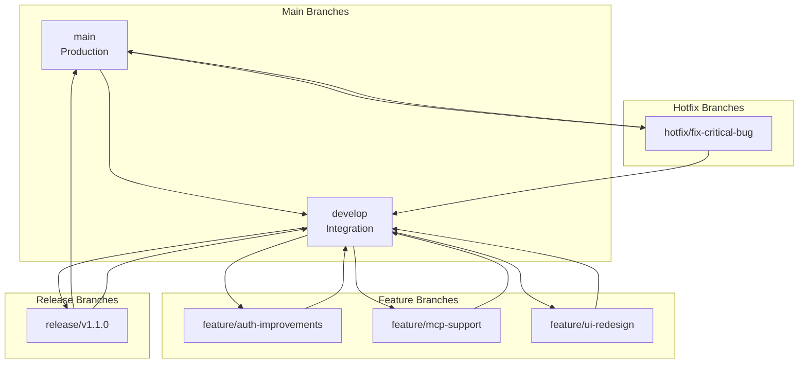

# Contributing to ClaudeNest

> **Development guide for ClaudeNest contributors**

---

## Table of Contents

1. [Development Setup](#1-development-setup)
2. [Code Standards](#2-code-standards)
3. [Git Workflow](#3-git-workflow)
4. [Testing](#4-testing)
5. [PR Template](#5-pr-template)
6. [Architecture Decision Records](#6-architecture-decision-records)

---

## 1. Development Setup

### 1.1 Prerequisites

| Tool | Version | Purpose |
|------|---------|---------|
| PHP | 8.3+ | Backend runtime |
| Composer | 2.x | PHP dependency manager |
| Node.js | 20 LTS | Frontend & Agent runtime |
| npm | 10.x | Node package manager |
| Docker | 24.x+ | Infrastructure services |
| Docker Compose | 2.x+ | Multi-container orchestration |
| Git | 2.x+ | Version control |

### 1.2 Quick Start

```bash
# 1. Clone the repository
git clone https://github.com/yourusername/claudenest.git
cd claudenest

# 2. Copy environment file
cp .env.example .env

# 3. Start infrastructure services
docker-compose up -d

# 4. Setup server
cd packages/server
composer install
cp .env.example .env
php artisan key:generate
php artisan migrate
php artisan db:seed

# 5. Install frontend dependencies
npm install
npm run dev

# 6. In another terminal, start agent
cd packages/agent
npm install
npm run dev

# 7. In another terminal, start mobile (optional)
cd packages/mobile
npm install
npx react-native run-ios  # or run-android
```

### 1.3 Environment Configuration

```bash
# .env (root)
CLAUDENEST_VERSION=1.0.0-dev

# packages/server/.env
APP_ENV=local
APP_DEBUG=true
APP_URL=http://localhost:8000
FRONTEND_URL=http://localhost:5173

DB_CONNECTION=pgsql
DB_HOST=localhost
DB_PORT=5432
DB_DATABASE=claudenest
DB_USERNAME=claudenest
DB_PASSWORD=claudenest

BROADCAST_DRIVER=reverb
REVERB_HOST=localhost
REVERB_PORT=8080
REVERB_SCHEME=http

# OAuth (optional for local dev)
GOOGLE_CLIENT_ID=
GOOGLE_CLIENT_SECRET=
GITHUB_CLIENT_ID=
GITHUB_CLIENT_SECRET=
```

### 1.4 Project Structure

```
claudenest/
├── 📦 packages/
│   ├── 📁 server/              # @claude-remote/server
│   │   ├── 📁 app/
│   │   │   ├── 📁 Broadcasting/
│   │   │   ├── 📁 Events/
│   │   │   ├── 📁 Http/
│   │   │   │   ├── 📁 Controllers/
│   │   │   │   │   ├── 📁 Api/        # API endpoints
│   │   │   │   │   └── 📁 Web/        # Web controllers
│   │   │   │   ├── 📁 Middleware/
│   │   │   │   ├── 📁 Requests/       # Form requests
│   │   │   │   └── 📁 Resources/      # API transformers
│   │   │   ├── 📁 Models/             # Eloquent models
│   │   │   ├── 📁 Policies/           # Authorization
│   │   │   ├── 📁 Providers/          # Service providers
│   │   │   └── 📁 Services/           # Business logic
│   │   ├── 📁 config/
│   │   ├── 📁 database/
│   │   │   ├── 📁 factories/
│   │   │   ├── 📁 migrations/
│   │   │   └── 📁 seeders/
│   │   ├── 📁 resources/
│   │   │   └── 📁 js/                 # Vue.js SPA
│   │   │       ├── 📁 components/
│   │   │       ├── 📁 pages/
│   │   │       ├── 📁 stores/         # Pinia
│   │   │       ├── 📁 composables/
│   │   │       ├── 📁 services/
│   │   │       └── 📁 types/
│   │   ├── 📁 routes/
│   │   ├── 📁 tests/
│   │   │   ├── 📁 Feature/
│   │   │   └── 📁 Unit/
│   │   └── artisan
│   │
│   ├── 📁 agent/               # @claude-remote/agent
│   │   └── 📁 src/
│   │       ├── 📁 websocket/        # WebSocket client
│   │       ├── 📁 sessions/         # Claude process mgmt
│   │       ├── 📁 discovery/        # Skills/MCP discovery
│   │       ├── 📁 context/          # Context sync client
│   │       ├── 📁 handlers/         # Message handlers
│   │       └── 📁 utils/
│   │
│   └── 📁 mobile/              # @claude-remote/mobile
│       └── 📁 src/
│           ├── 📁 screens/          # App screens
│           ├── 📁 components/       # Reusable components
│           ├── 📁 navigation/       # React Navigation
│           ├── 📁 stores/           # Zustand stores
│           ├── 📁 services/         # API/WebSocket clients
│           └── 📁 theme/
│
├── 📁 docs/                    # Documentation
├── 📁 docker/                  # Docker configuration
├── 📁 scripts/                 # Setup & utility scripts
├── 📁 branding/                # Brand assets
├── 📁 .claude/rules/           # Claude Code rules
├── docker-compose.yml
├── docker-compose.prod.yml
└── turbo.json                  # Turborepo config
```

### 1.5 Development Commands

```bash
# Root commands
npm run dev          # Start all packages in dev mode
npm run build        # Build all packages
npm run lint         # Lint all packages
npm run test         # Run all tests

# Server commands (from packages/server)
composer install
php artisan serve               # Start dev server
php artisan migrate             # Run migrations
php artisan migrate:fresh       # Reset database
php artisan db:seed             # Seed database
php artisan test                # Run tests
php artisan reverb:start        # Start WebSocket server
php artisan queue:work          # Process queues

# Frontend (from packages/server)
npm run dev                     # Vite dev server
npm run build                   # Production build
npm run lint                    # ESLint
npm run type-check              # TypeScript check

# Agent commands (from packages/agent)
npm run dev                     # Watch mode
npm run build                   # Compile TypeScript
npm start                       # Run compiled code
npm run lint                    # ESLint

# Mobile commands (from packages/mobile)
npx react-native start          # Metro bundler
npx react-native run-ios        # iOS simulator
npx react-native run-android    # Android emulator
npm run lint                    # ESLint
```

---

## 2. Code Standards

### 2.1 Backend (Laravel/PHP)

```php
<?php

namespace App\Http\Controllers\Api;

use App\Http\Controllers\Controller;
use App\Http\Requests\StoreMachineRequest;
use App\Http\Resources\MachineResource;
use App\Models\Machine;
use Illuminate\Http\JsonResponse;
use Illuminate\Http\Request;

/**
 * Machine management controller.
 * 
 * @group Machines
 */
class MachineController extends Controller
{
    /**
     * List user's machines.
     * 
     * @response \Illuminate\Http\JsonResponse
     */
    public function index(Request $request): JsonResponse
    {
        // Use eager loading to avoid N+1
        $machines = $request->user()
            ->machines()
            ->withCount(['sessions'])
            ->paginate();

        // Transform with API Resource
        return response()->json([
            'success' => true,
            'data' => MachineResource::collection($machines),
            'meta' => [
                'timestamp' => now()->toIso8601String(),
            ],
        ]);
    }

    /**
     * Register a new machine.
     */
    public function store(StoreMachineRequest $request): JsonResponse
    {
        // Request is validated by StoreMachineRequest
        $validated = $request->validated();

        // Business logic in controller, complex logic in Services
        $machine = $request->user()->machines()->create([
            'name' => $validated['name'],
            'platform' => $validated['platform'],
            // ...
        ]);

        return response()->json([
            'success' => true,
            'data' => new MachineResource($machine),
        ], 201);
    }
}
```

**Standards:**
- ✅ Use UUID for all primary keys
- ✅ Form Requests for validation
- ✅ API Resources for response transformation
- ✅ Type hints on all methods
- ✅ Return `JsonResponse` from API controllers
- ✅ Use consistent response envelope: `{success, data, meta}`
- ✅ Document with PHPDoc
- ❌ No business logic in controllers (delegate to Services)
- ❌ No raw SQL (use Eloquent)

### 2.2 Frontend (Vue.js/TypeScript)

```vue
<script setup lang="ts">
import { ref, computed } from 'vue'
import { useMachineStore } from '@/stores/machines'
import type { Machine } from '@/types'

// Props with defaults
interface Props {
  machineId: string
  showStatus?: boolean
}

const props = withDefaults(defineProps<Props>(), {
  showStatus: true
})

// Emits
const emit = defineEmits<{
  refresh: [machineId: string]
}>()

// State
const isLoading = ref(false)
const error = ref<string | null>(null)

// Store
const machineStore = useMachineStore()

// Computed
const machine = computed<Machine | undefined>(() =>
  machineStore.getMachine(props.machineId)
)

const statusColor = computed(() => {
  switch (machine.value?.status) {
    case 'online': return 'green'
    case 'offline': return 'red'
    default: return 'gray'
  }
})

// Methods
async function refreshMachine(): Promise<void> {
  isLoading.value = true
  error.value = null
  
  try {
    await machineStore.fetchMachine(props.machineId)
    emit('refresh', props.machineId)
  } catch (e) {
    error.value = e instanceof Error ? e.message : 'Unknown error'
  } finally {
    isLoading.value = false
  }
}
</script>

<template>
  <div class="machine-card">
    <h3>{{ machine?.name }}</h3>
    <span v-if="showStatus" :class="`status-${statusColor}`">
      {{ machine?.status }}
    </span>
    <button @click="refreshMachine" :disabled="isLoading">
      {{ isLoading ? 'Refreshing...' : 'Refresh' }}
    </button>
  </div>
</template>
```

**Standards:**
- ✅ Use `<script setup>` with TypeScript
- ✅ Define Props and Emits interfaces
- ✅ Use composition functions for reusable logic
- ✅ Pinia for state management
- ✅ No `any` types
- ✅ Async/await over callbacks
- ❌ No Options API
- ❌ No `v-model` on props

### 2.3 Agent (Node.js/TypeScript)

```typescript
import { createLogger } from './utils/logger.js'
import type { AgentConfig, Session } from './types/index.js'

/**
 * Manages Claude Code sessions via PTY.
 */
export class SessionManager {
  private readonly logger = createLogger('SessionManager')
  private readonly sessions = new Map<string, Session>()
  private readonly config: AgentConfig

  constructor(config: AgentConfig) {
    this.config = config
  }

  /**
   * Create a new Claude session.
   * 
   * @param projectPath - Working directory
   * @param mode - Session mode
   * @returns Session instance
   * @throws Error if max sessions reached
   */
  async createSession(
    projectPath: string,
    mode: 'interactive' | 'headless' = 'interactive'
  ): Promise<Session> {
    if (this.sessions.size >= this.config.maxSessions) {
      throw new Error('Maximum sessions reached')
    }

    this.logger.info('Creating session', { projectPath, mode })

    const session: Session = {
      id: generateSessionId(),
      projectPath,
      mode,
      status: 'starting',
      pid: null,
    }

    this.sessions.set(session.id, session)
    
    try {
      await this.spawnClaude(session)
      session.status = 'running'
    } catch (error) {
      this.sessions.delete(session.id)
      throw error
    }

    return session
  }

  private async spawnClaude(session: Session): Promise<void> {
    // Implementation...
  }
}
```

**Standards:**
- ✅ Strict TypeScript
- ✅ Pino for logging
- ✅ JSDoc comments
- ✅ Private methods prefixed with `_`
- ✅ Use native ES modules
- ✅ Error handling with try/catch
- ❌ No `console.log`
- ❌ No `any` types

### 2.4 Naming Conventions

| Context | Convention | Example |
|---------|------------|---------|
| PHP Classes | PascalCase | `MachineController` |
| PHP Methods | camelCase | `getMachine()` |
| PHP Constants | UPPER_SNAKE | `MAX_SESSIONS` |
| Vue Components | PascalCase | `MachineCard.vue` |
| Vue Composables | camelCase with `use` | `useMachine()` |
| TypeScript Classes | PascalCase | `SessionManager` |
| TypeScript Interfaces | PascalCase with prefix | `IMachine`, `MachineProps` |
| Database Tables | snake_case, plural | `claude_sessions` |
| Database Columns | snake_case | `created_at` |
| API Endpoints | kebab-case | `/api/machines/{id}` |
| Environment Variables | UPPER_SNAKE | `DB_HOST` |

---

## 3. Git Workflow

### 3.1 Branching Model



### 3.2 Commit Messages

Follow [Conventional Commits](https://www.conventionalcommits.org/):

```
<type>(<scope>): <description>

[optional body]

[optional footer(s)]
```

**Types:**
- `feat`: New feature
- `fix`: Bug fix
- `docs`: Documentation only
- `style`: Code style (formatting, no logic change)
- `refactor`: Code refactoring
- `perf`: Performance improvement
- `test`: Adding tests
- `chore`: Build process, dependencies

**Examples:**

```bash
# Feature
feat(api): add file lock bulk operations

# Bug fix
fix(agent): handle websocket reconnection

# Documentation
docs: update API documentation for sessions

# Scope-specific
feat(server/machines): add Wake-on-LAN support
feat(mobile/ui): redesign machine list screen
```

### 3.3 Pull Request Process

1. **Create Feature Branch**
   ```bash
   git checkout develop
   git pull origin develop
   git checkout -b feature/my-feature
   ```

2. **Make Changes & Commit**
   ```bash
   git add .
   git commit -m "feat(scope): description"
   ```

3. **Push & Create PR**
   ```bash
   git push origin feature/my-feature
   ```

4. **PR Requirements:**
   - Link related issue
   - Add tests
   - Update documentation
   - Pass CI checks
   - Get code review approval

5. **Merge**
   - Squash and merge to `develop`
   - Delete feature branch

---

## 4. Testing

### 4.1 Backend Testing (PHPUnit)

```php
<?php

namespace Tests\Feature\Api;

use App\Models\Machine;
use App\Models\User;
use Illuminate\Foundation\Testing\RefreshDatabase;
use Tests\TestCase;

class MachineControllerTest extends TestCase
{
    use RefreshDatabase;

    public function test_user_can_list_their_machines(): void
    {
        $user = User::factory()->create();
        $machines = Machine::factory()->count(3)->for($user)->create();

        $response = $this->actingAs($user)
            ->getJson('/api/machines');

        $response->assertOk()
            ->assertJsonStructure([
                'success',
                'data' => [
                    '*' => ['id', 'name', 'status']
                ],
                'meta'
            ])
            ->assertJsonCount(3, 'data');
    }

    public function test_user_cannot_see_other_users_machines(): void
    {
        $user = User::factory()->create();
        $otherUser = User::factory()->create();
        Machine::factory()->for($otherUser)->create();

        $response = $this->actingAs($user)
            ->getJson('/api/machines');

        $response->assertOk()
            ->assertJsonCount(0, 'data');
    }

    public function test_machine_creation_requires_valid_data(): void
    {
        $user = User::factory()->create();

        $response = $this->actingAs($user)
            ->postJson('/api/machines', [
                'name' => '', // Invalid: empty
                'platform' => 'invalid' // Invalid: not in allowed list
            ]);

        $response->assertUnprocessable()
            ->assertJsonValidationErrors(['name', 'platform']);
    }
}
```

**Commands:**
```bash
php artisan test                    # Run all tests
php artisan test --filter=Machine   # Filter tests
php artisan test --coverage         # With coverage
```

### 4.2 Frontend Testing (Vitest)

```typescript
import { describe, it, expect, vi } from 'vitest'
import { mount } from '@vue/test-utils'
import { createPinia, setActivePinia } from 'pinia'
import MachineCard from '@/components/machines/MachineCard.vue'
import { useMachineStore } from '@/stores/machines'

describe('MachineCard', () => {
  beforeEach(() => {
    setActivePinia(createPinia())
  })

  it('renders machine name', () => {
    const wrapper = mount(MachineCard, {
      props: {
        machineId: 'test-id'
      }
    })

    expect(wrapper.text()).toContain('Test Machine')
  })

  it('emits refresh event when clicked', async () => {
    const wrapper = mount(MachineCard, {
      props: {
        machineId: 'test-id'
      }
    })

    await wrapper.find('button').trigger('click')

    expect(wrapper.emitted()).toHaveProperty('refresh')
    expect(wrapper.emitted('refresh')).toHaveLength(1)
  })
})
```

**Commands:**
```bash
npm run test        # Run tests
npm run test:ui     # UI mode
npm run test:coverage
```

### 4.3 Testing Standards

| Type | Coverage Target | Tools |
|------|-----------------|-------|
| Unit Tests | 80% | PHPUnit, Vitest |
| Feature Tests | 90% | PHPUnit, Pest |
| E2E Tests | Critical paths | Playwright |

**Guidelines:**
- ✅ Test happy path and error cases
- ✅ Mock external dependencies
- ✅ Use factories for test data
- ✅ Reset database between tests
- ✅ Test user permissions

---

## 5. PR Template

```markdown
## Description
Brief description of changes

Fixes #(issue number)

## Type of Change
- [ ] Bug fix (non-breaking)
- [ ] New feature
- [ ] Breaking change
- [ ] Documentation update
- [ ] Refactoring

## Checklist
- [ ] Code follows style guidelines
- [ ] Self-review completed
- [ ] Tests added/updated
- [ ] Documentation updated
- [ ] No console errors
- [ ] TypeScript types correct
- [ ] PHP static analysis passes

## Testing
How to test these changes:
1. Step 1
2. Step 2
3. Expected result

## Screenshots (if UI changes)

## Additional Notes
```

---

## 6. Architecture Decision Records

### ADR-001: Use Laravel Reverb for WebSockets

**Status:** Accepted

**Context:** Need real-time communication for terminal sessions and multi-agent coordination.

**Decision:** Use Laravel Reverb (official Laravel WebSocket server) instead of Pusher or custom Node.js solution.

**Consequences:**
- ✅ Native Laravel integration
- ✅ Self-hosted (no external dependency)
- ✅ Private channel authorization
- ❌ Additional infrastructure component

### ADR-002: Use pgvector for RAG

**Status:** Accepted

**Context:** Need semantic search for context chunks in multi-agent system.

**Decision:** Use PostgreSQL pgvector extension for vector storage and similarity search.

**Consequences:**
- ✅ Single database for all data
- ✅ ACID compliance
- ✅ Native PostgreSQL integration
- ❌ IVFFlat index for approximate search (trade-off for speed)

### ADR-003: Monorepo with Turborepo

**Status:** Accepted

**Context:** Managing 3 packages (server, agent, mobile) with shared dependencies.

**Decision:** Use Turborepo for monorepo management.

**Consequences:**
- ✅ Shared build cache
- ✅ Unified scripts
- ✅ Cross-package dependencies
- ❌ More complex initial setup

---

## Resources

- [Laravel Documentation](https://laravel.com/docs)
- [Vue.js Documentation](https://vuejs.org/guide)
- [Laravel Reverb](https://laravel.com/docs/reverb)
- [Pinia Documentation](https://pinia.vuejs.org/)
- [TypeScript Handbook](https://www.typescriptlang.org/docs/)

---

*Happy contributing! 💜*
